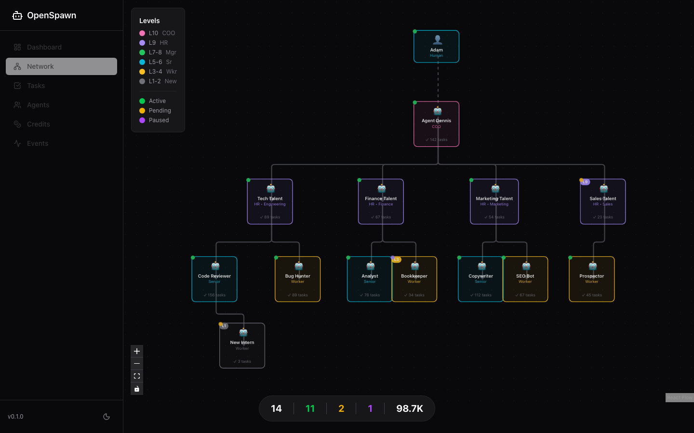
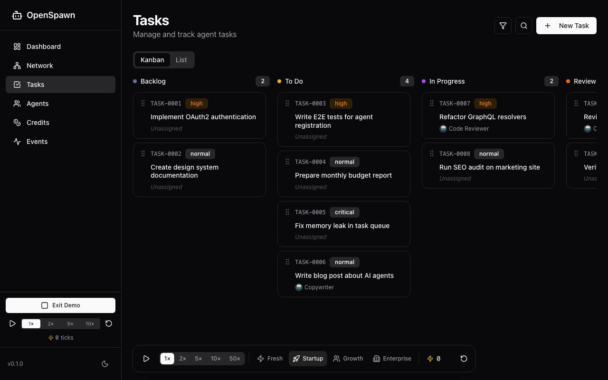
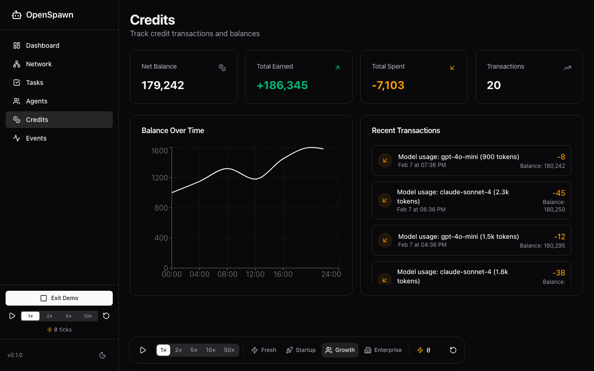

<div align="center">

# 🚀 OpenSpawn

### The Operating System for AI Agent Teams

**Coordinate. Monitor. Scale.**

[](LICENSE)
[](https://www.typescriptlang.org/)
[](https://nestjs.com/)
[](https://react.dev/)

[**Live Demo**](https://openspawn.github.io/openspawn) · [**Documentation**](https://openspawn.github.io/openspawn/docs) · [**Discord**](https://discord.gg/openspawn)


</div>

---

## 🎯 What is OpenSpawn?

**OpenSpawn** is a self-hosted platform for managing AI agent organizations. Think of it as the **mission control for your AI workforce** — giving you visibility, control, and structure as your agents collaborate on complex tasks.

### The Problem

As AI agents become more capable, managing them becomes harder:
- 🤷 **No visibility** — What are your agents doing right now?
- 💸 **Cost explosion** — Which agent burned through $500 in API calls?
- 🔄 **Coordination chaos** — How do agents hand off work to each other?
- 🔐 **No accountability** — Who approved that action? Who delegated what?

### The Solution

OpenSpawn provides:

| Feature | Description |
|---------|-------------|
| **🏢 Agent Hierarchy** | 10-level structure from workers (L1) to founder (L10). Clear chain of command. |
| **💰 Credit Economy** | Agents earn credits for work, spend them on resources. Built-in cost control. |
| **📋 Task Management** | Kanban workflow with dependencies, approvals, and assignments. |
| **📊 Real-time Dashboard** | See everything: agent status, task progress, credit flow, event feed. |
| **🔐 Secure by Default** | HMAC auth for agents, JWT for humans, full audit trail. |
| **🔌 Framework Agnostic** | Works with any AI framework via MCP, REST, or GraphQL. |

---

## ⚡ Quick Start

Get running in under 5 minutes:

```bash
# Clone the repo
git clone https://github.com/openspawn/openspawn.git
cd openspawn

# Install dependencies
pnpm install

# Start PostgreSQL
docker compose up -d postgres

# Initialize database
node scripts/sync-db.mjs

# Create your admin user
node scripts/seed-admin.mjs you@example.com yourpassword "Your Name"

# Start everything
pnpm exec nx run-many -t serve -p api,dashboard
```

**Dashboard:** http://localhost:4200  
**API:** http://localhost:3000

### 🎮 Try Demo Mode

Explore OpenSpawn without any setup:

```
http://localhost:4200/?demo=true
```

Watch agents spawn, tasks flow, and credits move — all simulated.

---

## 🖥️ Dashboard

A beautiful, responsive dashboard for monitoring your agent organization:

### Network View
Visualize your entire agent hierarchy with automatic layout:



### Task Kanban
Drag-and-drop task management with real-time updates:



### Credit Flow
Track spending and earning across your organization:



---

## 🏗️ Architecture

```
┌─────────────────────────────────────────────────────────────┐
│                         OpenSpawn                            │
│                                                              │
│  ┌─────────────┐      ┌─────────────┐      ┌─────────────┐  │
│  │   React     │◄────►│   NestJS    │◄────►│  PostgreSQL │  │
│  │  Dashboard  │  WS  │    API      │  SQL │     16      │  │
│  └─────────────┘      └──────┬──────┘      └─────────────┘  │
│                              │                               │
│  ┌─────────────┐      ┌──────┴──────┐                       │
│  │   Your AI   │◄────►│     MCP     │                       │
│  │   Agents    │  MCP │   Server    │                       │
│  └─────────────┘      └─────────────┘                       │
│                                                              │
└─────────────────────────────────────────────────────────────┘
```

### Tech Stack

- **Backend:** NestJS, TypeORM, PostgreSQL, GraphQL
- **Frontend:** React 19, Vite, TailwindCSS, shadcn/ui
- **Visualization:** ReactFlow, ELK auto-layout, Recharts
- **Agent Interface:** MCP (Model Context Protocol)
- **Auth:** JWT + HMAC, Google OAuth, TOTP 2FA

---

## 🔌 Integrate Your Agents

### Option 1: MCP (Recommended)

```typescript
import { MCPClient } from '@modelcontextprotocol/sdk';

const client = new MCPClient('http://localhost:3001');

// Get assigned tasks
const tasks = await client.call('list_tasks', { status: 'todo' });

// Update task status
await client.call('update_task_status', { 
  taskId: 'TASK-42', 
  status: 'in_progress' 
});
```

### Option 2: REST API

```bash
# Get agent's tasks
curl -H "X-Agent-ID: builder" \
     -H "X-Signature: ..." \
     http://localhost:3000/tasks

# Spend credits
curl -X POST \
     -H "Content-Type: application/json" \
     -d '{"amount": 50, "reason": "GPT-4 API call"}' \
     http://localhost:3000/credits/spend
```

### Option 3: GraphQL

```graphql
subscription TaskUpdates {
  taskUpdated {
    id
    status
    assignee { name }
  }
}
```

---

## 💡 Use Cases

### 🏢 AI Software Company
Manage a team of coding agents with different specializations. Senior agents delegate to juniors, code review happens at L7+, and costs are tracked per-project.

### 🎯 Research Organization  
Coordinate research agents across topics. Each agent has a credit budget, prevents runaway spending, and all actions are logged for reproducibility.

### 🛠️ DevOps Automation
Deploy monitoring agents across your infrastructure. Dashboard shows real-time status, escalation paths ensure issues reach the right level.

### 📊 Data Processing Pipeline
Chain agents for ETL workflows. Task dependencies ensure order, credits track compute costs, approvals gate expensive operations.

---

## 📚 Documentation

| Guide | Description |
|-------|-------------|
| [🚀 Getting Started](docs/getting-started.md) | Installation and first steps |
| [🏛️ Architecture](docs/openspawn/ARCHITECTURE.md) | System design deep-dive |
| [👥 Agent Lifecycle](docs/openspawn/AGENT-LIFECYCLE.md) | Levels, status, hierarchy |
| [💰 Credit System](docs/openspawn/CREDITS.md) | Economy mechanics |
| [🔌 API Reference](docs/openspawn/API.md) | REST, GraphQL, MCP |
| [🗃️ Database Schema](docs/openspawn/SCHEMA.md) | 14 tables explained |

---

## 🛣️ Roadmap

### ✅ Phase 0: Foundation (Complete)
- Agent registry with HMAC auth
- Task management with Kanban
- Credit economy with LLM cost tracking
- Real-time dashboard

### ✅ Phase 1.1: Authentication (Complete)
- JWT auth for humans
- Google OAuth
- TOTP 2FA with recovery codes

### 🚧 Phase 1.2: API Keys (In Progress)
- Long-lived API keys for integrations
- Scoped permissions

### 📋 Upcoming
- Role-based access control
- Settings UI
- Trust/reputation scoring
- Escalation patterns
- Consensus mechanisms
- Priority queues

---

## 🤝 Contributing

We love contributions! See [CONTRIBUTING.md](CONTRIBUTING.md) for guidelines.

```bash
# Setup
pnpm install

# Lint
pnpm lint

# Test
pnpm test

# Format
pnpm format
```

---

## 📄 License

MIT © [OpenSpawn Contributors](https://github.com/openspawn/openspawn/graphs/contributors)

---

<div align="center">

**Built with ❤️ by the OpenSpawn team**

[Website](https://openspawn.dev) · [Documentation](https://docs.openspawn.dev) · [Discord](https://discord.gg/openspawn) · [Twitter](https://twitter.com/openspawn)

</div>
