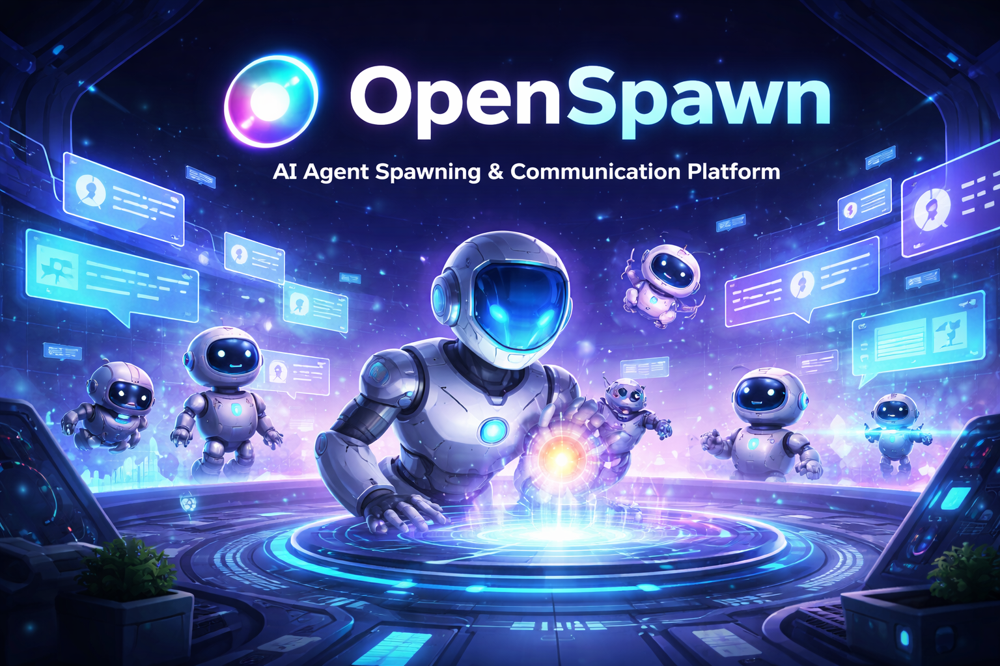

# OpenSpawn



**Self-hosted platform for multi-agent coordination, communication, and economy management.**

OpenSpawn provides the operational backbone for AI agent organizations — enabling agents to receive tasks, exchange messages, earn and spend credits, and be monitored by human operators through a real-time dashboard.

Born from the OpenClaw multi-agent ecosystem, OpenSpawn solves the coordination gap that emerges when organizations scale beyond a single AI agent.

---

## Key Features

- **Agent Registry & Identity** — HMAC-signed authentication, Talent Agent as trust root
- **Task Management** — Full lifecycle with dependencies, approval gates, status workflows
- **Credit Economy** — Event-driven earning, dynamic LLM cost pricing, materialized balances, management fees
- **Messaging** — Structured channels (per-task, per-agent, broadcast) with threaded conversations
- **Event Log** — Append-only audit trail with actor attribution
- **Real-Time Dashboard** — React SPA with GraphQL subscriptions (Kanban, P&L, activity feed)
- **MCP Server** — Primary agent interface via Streamable HTTP
- **LLM Observability** — Langfuse + LiteLLM integration for cost tracking

---

## Tech Stack

- **Backend**: NestJS + TypeORM + PostgreSQL 16
- **MCP Server**: `@modelcontextprotocol/sdk` with Streamable HTTP
- **Dashboard**: React 18 + Vite + Tailwind + urql (GraphQL)
- **Tooling**: Nx monorepo + pnpm + Biome + Vitest
- **Deployment**: Docker Compose → Coolify on Hetzner CX32 behind Tailscale

---

## Documentation

| Document                                                           | Description                                            |
| ------------------------------------------------------------------ | ------------------------------------------------------ |
| [PRD](docs/openspawn/PRD.md)                                       | Product vision, user stories, success metrics          |
| [Architecture](docs/openspawn/ARCHITECTURE.md)                     | Service boundaries, data flows, scaling considerations |
| [API](docs/openspawn/API.md)                                       | Complete REST + GraphQL + MCP tool specifications      |
| [Schema](docs/openspawn/SCHEMA.md)                                 | Database design: 14 tables, indexes, conventions       |
| [Implementation Plan](docs/openspawn/plans/implementation-plan.md) | Phased build guide (6 PRs, 20 steps)                   |

---

## Getting Started

### Prerequisites

- Node.js 22+
- pnpm
- Docker + Docker Compose
- PostgreSQL 16

### Quick Start

```bash
# Clone the repository
git clone https://github.com/openspawn/openspawn.git
cd openspawn

# Install dependencies
pnpm install

# Start development environment
docker compose -f docker-compose.dev.yml up
```

Full implementation guide: [docs/openspawn/plans/implementation-plan.md](docs/openspawn/plans/implementation-plan.md)

---

## Project Status

**Phase**: Pre-implementation (planning complete)

Comprehensive specs and implementation plan are ready. Next step: scaffold the Nx monorepo (PR 1).

---

## Architecture Overview

```
┌─────────────────────────────────────────────────────────┐
│                    Tailscale Mesh                        │
│                                                         │
│  ┌──────────┐   MCP    ┌──────────┐   SQL   ┌────────┐ │
│  │ OpenClaw ├─────────►│   MCP    ├────────►│        │ │
│  │  Agents  │          │  Server  │         │ Post-  │ │
│  └──────────┘          └──────────┘         │ greSQL │ │
│                              │               │  16    │ │
│  ┌──────────┐   REST   ┌────┴─────┐         │        │ │
│  │ External ├─────────►│  NestJS  ├────────►│        │ │
│  │  Agents  │          │   API    │         │        │ │
│  └──────────┘          └────┬─────┘         └────────┘ │
│                              │ GraphQL                   │
│  ┌──────────┐          ┌────┴─────┐                     │
│  │  React   │◄─────────┤ GraphQL  │                     │
│  │Dashboard │  WS Sub  │Resolvers │                     │
│  └──────────┘          └──────────┘                     │
│                                                         │
│  ┌──────────┐          ┌──────────┐                     │
│  │ LiteLLM  │◄────────►│ Langfuse │                     │
│  │  Proxy   │  traces  │Observ.   │                     │
│  └──────────┘          └──────────┘                     │
└─────────────────────────────────────────────────────────┘
```

---

## License

[License TBD]

---

## Related Projects

- [OpenClaw](docs/openclaw-architecture.md) — Multi-agent routing layer (gateway to Claude)
