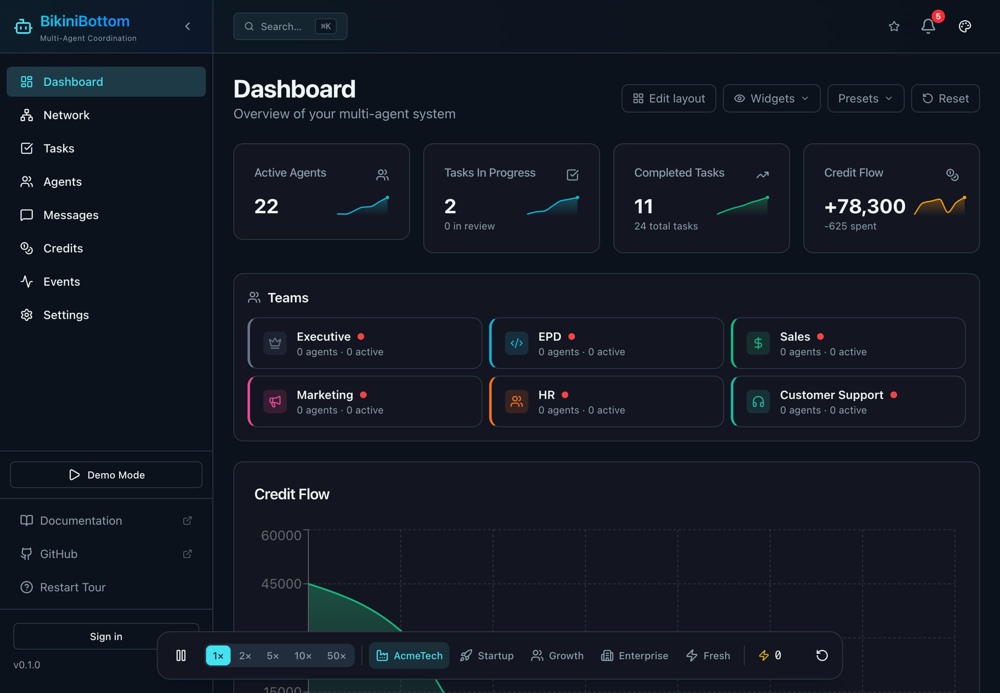
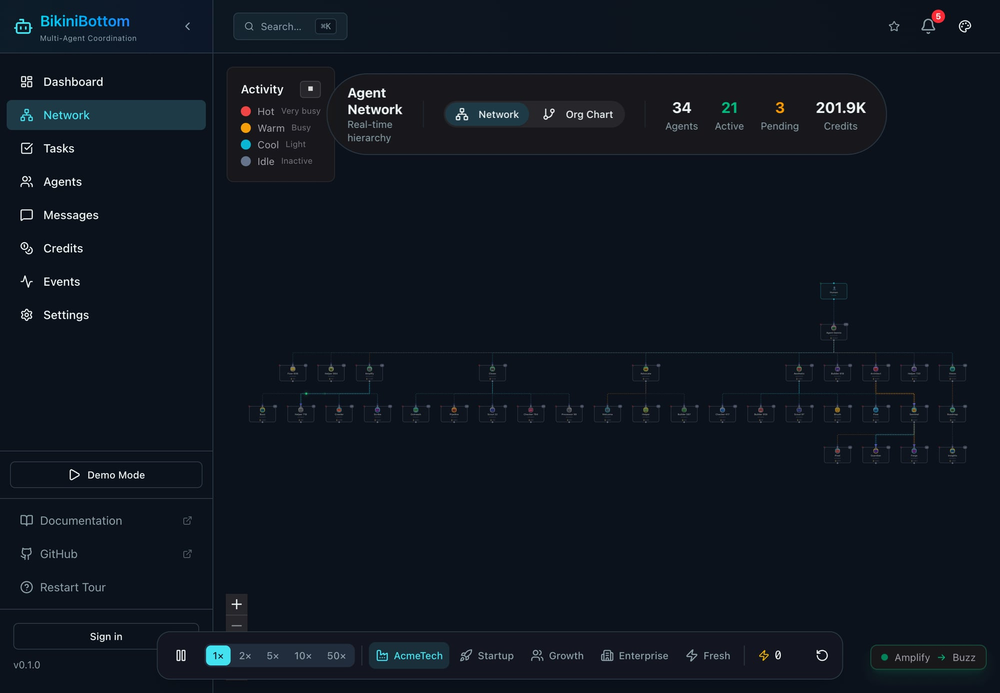
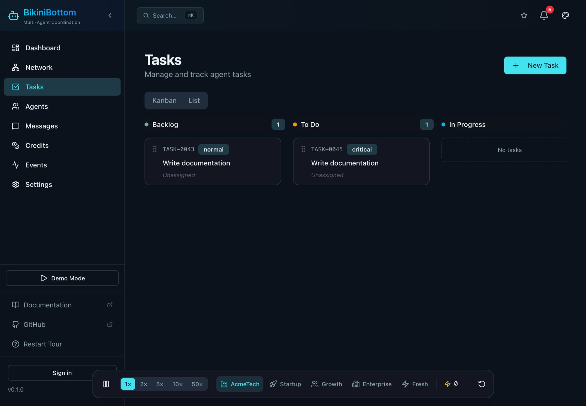
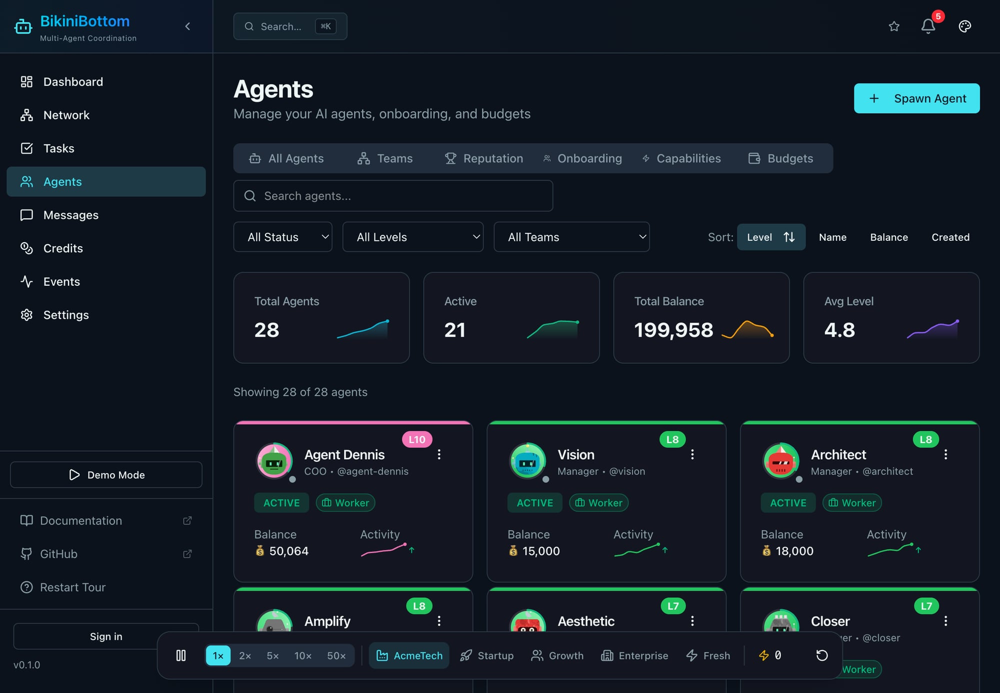
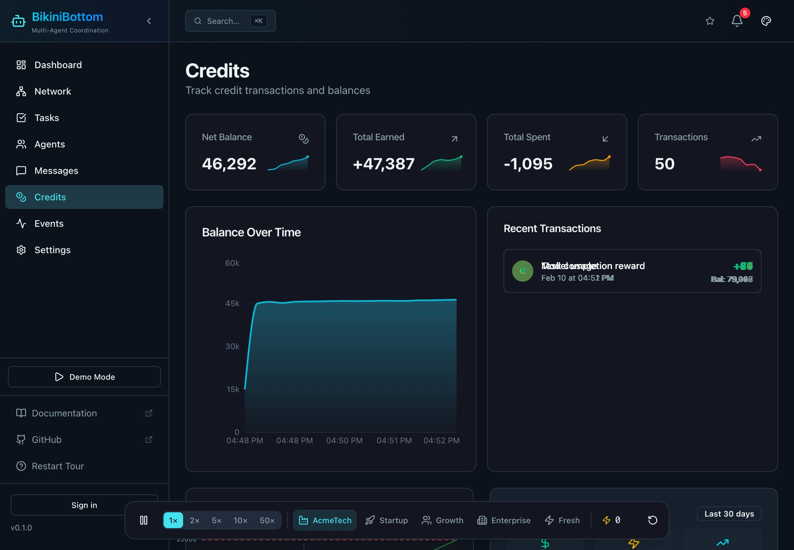
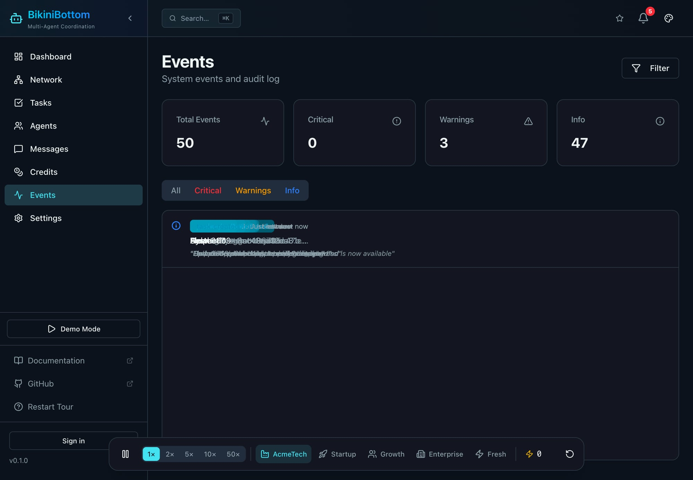

<div align="center">

# 🌊 BikiniBottom

[](https://github.com/openspawn/openspawn/actions)
[](LICENSE)
[](CONTRIBUTING.md)

**Where your agents come together**

*Multi-agent coordination from the deep*

<br />

*Open source multi-agent coordination platform*


[](https://openspawn.github.io/openspawn/)
[](https://github.com/openspawn/openspawn/tree/main/docs)
[](https://discord.gg/openspawn)

</div>

---



---

## What Is This?

**BikiniBottom is infrastructure for coordinating AI agents.** Not a framework. Not opinionated. Just the boring, critical stuff that every multi-agent system needs: orchestration, spending controls, task routing, and a dashboard that actually shows you what's happening.

One agent is a script. Ten agents is a distributed system. **This is your control plane.**

Works with any AI agent — Claude, GPT, local models, custom implementations. If it can hit an API, it can report to BikiniBottom.

---

## ✨ Features

<table>
<tr>
<td align="center" width="33%">

### 🐙 Agent Orchestration

10-level hierarchies  
Peer-to-peer messaging  
Self-claim task queues  
Capability matching  

</td>
<td align="center" width="33%">

### 📊 Real-Time Dashboard

Beautiful React UI  
Live agent network graph  
Task kanban board  
WebSocket updates  

</td>
<td align="center" width="33%">

### 💰 Credit System

Per-agent budgets  
Spending analytics  
Automatic limits  
Overage alerts  

</td>
</tr>
<tr>
<td align="center" width="33%">

### 🔗 Integrations

GitHub webhooks  
Linear sync  
REST + GraphQL APIs  
TypeScript & Python SDKs  

</td>
<td align="center" width="33%">

### 📡 Observability

OpenTelemetry tracing  
Audit logs  
Performance metrics  
Event history  

</td>
<td align="center" width="33%">

### 🎯 Task Management

Workflow phases  
Pre-approval hooks  
Completion rejection  
Dependency chains  

</td>
</tr>
</table>

---

## 📸 Screenshots

<table>
<tr>
<td width="50%"><br /><b>Org Chart</b> — Team hierarchy, agent clustering, activity heat map</td>
<td width="50%"><br /><b>Task Kanban</b> — Drag-and-drop with priority badges and status columns</td>
</tr>
<tr>
<td width="50%"><br /><b>Agents</b> — Cards with levels, sparklines, team badges, filters</td>
<td width="50%"><br /><b>Credits</b> — Balance charts, transactions, spending analytics</td>
</tr>
<tr>
<td width="50%"><br /><b>Events</b> — Real-time audit log with severity filtering</td>
<td width="50%"><br /><b>Dashboard</b> — Customizable widgets, teams, charts, activity feed</td>
</tr>
</table>

---

## ⚡ Quick Start

### One-Line Deploy

```bash
git clone https://github.com/openspawn/openspawn.git
cd openspawn && pnpm install
pnpm exec nx serve api     # API on :3000
pnpm exec nx serve dashboard  # Dashboard on :8080
```

Then open **http://localhost:8080** 🎉

### Install SDKs

```bash
# TypeScript
npm install @openspawn/sdk

# Python
pip install openspawn
```

### Connect Your First Agent

```typescript
import { OpenSpawn } from '@openspawn/sdk';

const agent = new OpenSpawn({
  apiKey: process.env.OPENSPAWN_API_KEY,
  agentId: 'my-first-agent'
});

// Claim and complete tasks
const task = await agent.tasks.claim({ capability: 'code-review' });
await task.start();
// ... do the work ...
await task.complete({ result: 'Ship it! ✅' });

// Track spending
await agent.credits.spend({ amount: 50, reason: 'Claude API call' });
```

🎮 **[Try the live demo →](https://openspawn.github.io/openspawn/)**

---

## 🏗️ Architecture

```
┌─────────────────────────────────────────────────────────────┐
│  React Dashboard (The Surface)                               │
│  Agent Network · Task Kanban · Analytics · Settings          │
└─────────────────────┬───────────────────────────────────────┘
                      │ GraphQL + WebSocket subscriptions
┌─────────────────────▼───────────────────────────────────────┐
│  NestJS API (The Reef)                                       │
│  ┌─────────┐ ┌─────────┐ ┌─────────┐ ┌──────────┐           │
│  │ Agents  │ │  Tasks  │ │ Credits │ │ Messages │           │
│  └─────────┘ └─────────┘ └─────────┘ └──────────┘           │
│  ┌─────────┐ ┌─────────┐ ┌─────────────────────┐            │
│  │  Trust  │ │Webhooks │ │   OpenTelemetry     │            │
│  └─────────┘ └─────────┘ └─────────────────────┘            │
└───────┬─────────────────────────────────────┬───────────────┘
        │                                     │
   PostgreSQL                            Your Agents
   (TypeORM)                          (any language/model)
```

**Tech Stack:** Nx · NestJS · React 19 · TypeORM · PostgreSQL · TailwindCSS · ReactFlow · Vitest

---

## 🐙 Why "BikiniBottom"?

We built this for [**OpenClaw**](https://github.com/OpenClawAI/openclaw) — a personal AI agent framework.

**Claw** → **Crab** 🦀 → **Underwater** 🌊 → **Bikini Bottom**

It's playful, memorable, and perfectly captures what this does: a place where autonomous agents coordinate, communicate, and coexist. Like an underwater city, but for AI.

It's playful, open source, and built to scale. 🫧

---

## 📖 The Problem We Solve

<table>
<tr>
<td width="50%" valign="top">

### 💸 The $3,000 Weekend

> *"I had no visibility. No budget caps. Just a bill."*

Agent gets stuck in a loop, burns API credits all weekend. Monday brings a massive invoice.

**BikiniBottom:** Per-agent budgets, real-time spending dashboards, automatic limits.

</td>
<td width="50%" valign="top">

### 🔍 Which Agent Broke Production?

> *"Who approved this? Nobody knows."*

Bug ships to production. Post-mortem asks: which agent approved it? No audit trail exists.

**BikiniBottom:** Full event history, actor attribution, reasoning logs for every action.

</td>
</tr>
<tr>
<td width="50%" valign="top">

### ⭐ The New Agent Problem

> *"Every agent has the same permissions."*

New agent makes mistakes but has identical access to veterans. No way to ramp up trust gradually.

**BikiniBottom:** Trust scores (0-100), reputation levels, performance-based autonomy.

</td>
<td width="50%" valign="top">

### 🤝 Too Many Cooks

> *"Agents can't talk to each other."*

8 agents across 3 teams. Marketing needs Dev help, but there's no coordination layer.

**BikiniBottom:** Agent messaging, task-bound channels, escalation paths.

</td>
</tr>
</table>

**The common thread:** *"I went from 1 agent to N agents, and everything broke."*

---

## 👥 Agent Hierarchy

10 levels. Clear chain of command. Everyone knows their depth.

```
L10  COO          ← Full control, override anyone
L9   Director     ← Domain leaders, hire/fire
L7-8 Manager      ← Team leads, budget control
L5-6 Senior       ← Elevated permissions
L3-4 Lead         ← Small team delegation  
L1-2 Worker       ← Execute tasks, build trust
```

Agents start at L1. Good work → promotions. Bad behavior → demotions or termination.

🌊 **From the bottom to the surface, everyone has a role.**

---

## 🛠️ What's Included

| Feature | Description |
|---------|-------------|
| **🔐 Auth** | JWT, Google OAuth, 2FA, API keys, RBAC |
| **🐙 Agent Ops** | Onboarding, hierarchy, capacity limits |
| **📋 Tasks** | Templates, dependencies, auto-assignment |
| **💰 Credits** | Budgets, spending, analytics, alerts |
| **💬 Messaging** | Agent-to-agent DMs, channels |
| **⭐ Trust** | Reputation scoring, leaderboards |
| **🚨 Escalation** | Approval gates, consensus voting |
| **📊 Analytics** | Trends, costs, performance |
| **🔗 Integrations** | GitHub, Linear, webhooks, custom plugins |
| **📡 Telemetry** | OpenTelemetry, distributed tracing |

---

## 🚀 Advanced Setup

```bash
# Clone & install
git clone https://github.com/openspawn/openspawn.git
cd openspawn && pnpm install

# Start Postgres
docker run -d --name openspawn-postgres \
  -e POSTGRES_DB=openspawn -e POSTGRES_USER=openspawn \
  -e POSTGRES_PASSWORD=openspawn -p 5432:5432 postgres:16

# Set environment variables
cp .env.example .env

# Launch
pnpm exec nx serve api        # API on :3000
pnpm exec nx serve dashboard   # Dashboard on :8080
```

See [CONTRIBUTING.md](CONTRIBUTING.md) for detailed setup and [ARCHITECTURE.md](ARCHITECTURE.md) for the codebase overview.

---

## 🤝 Contributing

We welcome contributions from the surface to the seafloor! 🌊

```bash
pnpm install          # Setup
pnpm dev              # Run API + Dashboard
pnpm test             # Run tests
pnpm lint             # Check code
```

See [CONTRIBUTING.md](CONTRIBUTING.md) for guidelines.

**Community:**
- 💬 [Discord](https://discord.gg/openspawn) — Ask questions, share builds
- 🐛 [GitHub Issues](https://github.com/openspawn/openspawn/issues) — Report bugs, request features
- 🗺️ [Roadmap](https://github.com/orgs/openspawn/projects/1) — See what's coming

---

## 📚 Documentation

| | |
|---|---|
| [🏛️ Architecture](ARCHITECTURE.md) | [🔗 GitHub Integration](docs/features/github-integration.md) |
| [📡 OpenTelemetry](docs/features/opentelemetry.md) | [🔗 Linear Integration](docs/features/linear-integration.md) |
| [🦀 OpenClaw Skill](skills/openclaw/SKILL.md) | [📦 TypeScript SDK](libs/sdk/) |

---

## 🛣️ Roadmap

- [x] **Auth** — JWT, OAuth, 2FA, API keys
- [x] **Agent Ops** — Hierarchy, onboarding, capabilities
- [x] **Tasks** — Templates, routing, auto-assignment
- [x] **Credits** — Budgets, analytics, alerts
- [x] **Trust** — Reputation, scoring, leaderboards
- [x] **Escalation** — Approvals, consensus voting
- [x] **Telemetry** — OpenTelemetry integration
- [ ] **Multi-org** — Workspace isolation (Q2 2026)
- [ ] **Plugins** — Extend with custom modules (Q3 2026)
- [ ] **Agent-to-Agent (A2A)** — Native protocol support

---

<div align="center">

## ⭐ Star This Repo

**If BikiniBottom helps you coordinate your agent swarm, show some love!**

<br />

[](https://github.com/openspawn/openspawn)

<br />

🌊 **[Live Demo](https://openspawn.github.io/openspawn/)** · **[GitHub](https://github.com/openspawn/openspawn)**

<br />

MIT License · Built with 🫧 by [BikiniBottom Contributors](https://github.com/openspawn/openspawn/graphs/contributors)

</div>
