<div align="center">

# 🚀 OpenSpawn

### The Operating System for AI Agent Teams

**Coordinate. Monitor. Scale.**

[](LICENSE)
[](https://www.typescriptlang.org/)
[](https://nestjs.com/)
[](https://react.dev/)
[](#-whats-included)

[**🎮 Live Demo**](https://openspawn.github.io/openspawn/demo/) · [**📚 Documentation**](https://openspawn.github.io/openspawn/) · [**💬 Discord**](https://discord.gg/openspawn)


</div>

---

## 🎯 What is OpenSpawn?

**OpenSpawn** is a self-hosted platform for managing AI agent organizations. Think of it as **mission control for your AI workforce** — giving you visibility, control, and structure as your agents collaborate on complex tasks.

### The Problem

As AI agents become more capable, managing them becomes harder:

| Challenge | Pain Point |
|-----------|------------|
| 🤷 **No visibility** | What are your agents doing right now? |
| 💸 **Cost explosion** | Which agent burned through $500 in API calls? |
| 🔄 **Coordination chaos** | How do agents hand off work to each other? |
| 🔐 **No accountability** | Who approved that action? Who delegated what? |
| 🌳 **Flat hierarchies** | No way to structure teams or set reporting chains |

### The Solution

OpenSpawn provides everything you need to run an AI agent organization:

<table>
<tr>
<td width="50%">

### 🏢 Agent Hierarchy
10-level structure from workers (L1) to founder (L10). Parent-child relationships with capacity limits.

### 💰 Credit Economy  
Agents earn credits for work, spend them on resources. Budget limits, transfers, and alerts.

### 📋 Task Management
Kanban workflow with templates, dependencies, approvals, and capability-based routing.

</td>
<td width="50%">

### 🎯 Capability Matching
Tag agents with skills (basic/standard/expert). Auto-assign tasks to best-fit agents.

### 💬 Agent Messaging
Direct messages between agents with read/unread tracking and conversation threads.

### 📊 Real-time Analytics
Spending trends, budget alerts, top spenders, and org-wide statistics.

</td>
</tr>
</table>

---

## ⚡ Quick Start

Get running in under 5 minutes:

```bash
# Clone the repo
git clone https://github.com/openspawn/openspawn.git
cd openspawn

# Install dependencies
pnpm install

# Start PostgreSQL
docker compose up -d postgres

# Initialize database
node scripts/sync-db.mjs

# Create your admin user
node scripts/seed-admin.mjs you@example.com yourpassword "Your Name"

# Start everything
pnpm exec nx run-many -t serve -p api,dashboard
```

| Service | URL |
|---------|-----|
| **Dashboard** | http://localhost:4200 |
| **API** | http://localhost:3000 |
| **GraphQL** | http://localhost:3000/graphql |

### 🎮 Try Demo Mode

Explore OpenSpawn without any setup — watch agents spawn, tasks flow, and credits move:

**[→ Launch Live Demo](https://openspawn.github.io/openspawn/demo/)**

---

## ✨ What's Included

### Phase 1: Authentication & Security ✅

- **JWT Authentication** — Secure human login with sessions
- **Google OAuth** — One-click sign in
- **TOTP 2FA** — Time-based codes with recovery backup
- **API Keys** — Long-lived keys for integrations
- **RBAC** — Role-based access control (Admin/Operator/Viewer)

### Phase 2: Agent Operations ✅

- **Agent Onboarding** — Spawn → Pending → Activate flow
- **Hierarchy Management** — Parent-child relationships, capacity limits by level
- **Budget Control** — Period limits, credit transfers, >80% alerts
- **Capability System** — Skills with proficiency (basic/standard/expert)
- **Direct Messaging** — Agent-to-agent DMs with read tracking

### Phase 3: Task Workflow ✅

- **Task Templates** — Reusable templates with `{{variable}}` substitution
- **Subtask Support** — Break work into manageable pieces
- **Capability Routing** — Match tasks to agents by required skills
- **Auto-Assignment** — Intelligent scoring: coverage + proficiency + level + workload
- **Approval Gates** — Require sign-off before completion

### Phase 4: Credit System ✅

- **Earning Mechanics** — Credits for task completion, delegation bonuses
- **Spending Controls** — Balance checks, budget enforcement, atomic transactions
- **Analytics Dashboard** — Trends, agent summaries, trigger breakdown
- **Smart Alerts** — Low balance, high velocity, budget exceeded
- **Cost Attribution** — Track spending by task, agent, and trigger type

---

## 🏗️ Architecture

```mermaid
flowchart TB
    subgraph Frontend["🖥️ Frontend"]
        Dashboard["React Dashboard<br/>Network · Kanban · Analytics"]
    end
    
    subgraph Backend["⚡ Backend"]
        API["NestJS API Server"]
        subgraph Modules["Core Modules"]
            Agents["Agents"]
            Tasks["Tasks"]
            Credits["Credits"]
            Messages["Messages"]
        end
        MCP["🔌 MCP Server"]
        DB[("🗄️ PostgreSQL<br/>14 Tables")]
    end
    
    subgraph External["🌐 External"]
        AI["🤖 AI Agents<br/>Claude · GPT · Local"]
        Services["☁️ Services<br/>LiteLLM · LangFuse"]
    end
    
    Dashboard <-->|"WebSocket + REST"| API
    API --> Modules
    API <--> DB
    API <--> MCP
    MCP <-->|"MCP Protocol"| AI
    API -.->|"Webhooks"| Services
```



### Tech Stack

| Layer | Technologies |
|-------|--------------|
| **Backend** | NestJS 11, TypeORM, PostgreSQL 16, GraphQL (code-first) |
| **Frontend** | React 19, Vite, TailwindCSS 4, shadcn/ui, ReactFlow |
| **Auth** | JWT, Google OAuth, TOTP 2FA, HMAC for agents |
| **Agent Interface** | MCP (Model Context Protocol), REST, GraphQL subscriptions |
| **DevOps** | Docker Compose, Nx monorepo, GitHub Actions |

---

## 👥 Agent Hierarchy

OpenSpawn uses a 10-level hierarchy inspired by corporate structures:

| Level | Role | Powers | Max Children |
|-------|------|--------|--------------|
| **L10** | COO | Full control, override anyone | 100 |
| **L9** | VP/Director | Hire/fire up to L8, domain expertise | 50 |
| **L7-8** | Manager | Spawn workers, manage budgets | 12-20 |
| **L5-6** | Senior | Elevated limits, mentor juniors | 5-8 |
| **L3-4** | Team Lead | Small team delegation | 2-3 |
| **L1-2** | Worker | Execute tasks, earn trust | 0 |

### Agent Lifecycle


---

## 🔌 Integrate Your Agents

### Option 1: MCP (Recommended)

```typescript
// Your agent connects via MCP
const tasks = await mcp.call('task_list', { status: 'assigned' });

for (const task of tasks) {
  await mcp.call('task_transition', { 
    taskId: task.id, 
    status: 'in_progress' 
  });
  
  // Do the work...
  
  await mcp.call('task_transition', { 
    taskId: task.id, 
    status: 'done' 
  });
}
```

### Option 2: REST API

```bash
# List your tasks
curl -H "Authorization: Bearer $TOKEN" \
     http://localhost:3000/tasks?assigneeId=me

# Spend credits for an external API call
curl -X POST http://localhost:3000/credits/spend \
     -H "Authorization: Bearer $TOKEN" \
     -d '{"amount": 10, "reason": "GitHub API call"}'

# Send a direct message to another agent
curl -X POST http://localhost:3000/dm \
     -H "Authorization: Bearer $TOKEN" \
     -d '{"toAgentId": "uuid", "body": "Task handoff: PR ready for review"}'
```

### Option 3: GraphQL Subscriptions

```graphql
subscription WatchTasks {
  taskUpdated {
    id
    identifier
    status
    assignee { name level }
  }
}
```

---

## 📊 API Overview

OpenSpawn exposes **50+ REST endpoints** across these domains:

<table>
<tr>
<td>

### Agents
```
POST   /agents/spawn
GET    /agents/capacity
GET    /agents/pending
POST   /agents/:id/activate
DELETE /agents/:id/reject
GET    /agents/:id/hierarchy
GET    /agents/:id/capabilities
POST   /agents/:id/capabilities
```

</td>
<td>

### Tasks
```
POST   /tasks
GET    /tasks
POST   /tasks/:id/transition
POST   /tasks/:id/auto-assign
GET    /tasks/:id/candidates
GET    /tasks/templates
POST   /tasks/templates/instantiate
```

</td>
</tr>
<tr>
<td>

### Credits
```
GET    /credits/balance
POST   /credits/spend
GET    /credits/history
GET    /credits/analytics/stats
GET    /credits/analytics/trends
GET    /credits/analytics/alerts
```

</td>
<td>

### Messages
```
POST   /dm
GET    /dm/conversations
GET    /dm/:agentId
PATCH  /dm/:agentId/read
GET    /dm/unread
```

</td>
</tr>
</table>

**[→ Full API Reference](https://openspawn.github.io/openspawn/openspawn/API)**

---

## 📚 Documentation

| Guide | Description |
|-------|-------------|
| [🚀 Getting Started](https://openspawn.github.io/openspawn/getting-started) | Installation and first steps |
| [🏛️ Architecture](https://openspawn.github.io/openspawn/openspawn/ARCHITECTURE) | System design deep-dive |
| [👥 Agent Lifecycle](https://openspawn.github.io/openspawn/openspawn/AGENT-LIFECYCLE) | Levels, onboarding, hierarchy |
| [📋 Task Workflow](https://openspawn.github.io/openspawn/openspawn/TASK-WORKFLOW) | Templates, routing, approvals |
| [💰 Credit System](https://openspawn.github.io/openspawn/openspawn/CREDITS) | Economy, budgets, analytics |
| [🔌 API Reference](https://openspawn.github.io/openspawn/openspawn/API) | 50+ endpoints documented |
| [🗃️ Database Schema](https://openspawn.github.io/openspawn/openspawn/SCHEMA) | 14 tables explained |

---

## 💡 Use Cases

### 🏢 AI Software Company
Manage a team of coding agents with different specializations. Senior agents delegate to juniors, code review happens at L7+, and costs are tracked per-project.

### 🔬 Research Organization  
Coordinate research agents across topics. Each agent has a credit budget, prevents runaway spending, and all actions are logged for reproducibility.

### 🛠️ DevOps Automation
Deploy monitoring agents across your infrastructure. Dashboard shows real-time status, escalation paths ensure issues reach the right level.

### 📊 Data Pipeline
Chain agents for ETL workflows. Task dependencies ensure order, credits track compute costs, capability matching assigns the right agent to each step.

---

## 🛣️ Roadmap

| Phase | Status | Features |
|-------|--------|----------|
| **Phase 1** | ✅ Complete | JWT auth, OAuth, 2FA, API keys, RBAC, Settings UI |
| **Phase 2** | ✅ Complete | Agent onboarding, hierarchy, budgets, capabilities, DMs |
| **Phase 3** | ✅ Complete | Task templates, routing, auto-assignment |
| **Phase 4** | ✅ Complete | Credit analytics, alerts, spending insights |
| **Phase 5** | 📋 Planned | Trust scoring, reputation, automated promotions |
| **Phase 6** | 📋 Planned | Escalation patterns, consensus, priority queues |

---

## 🤝 Contributing

We love contributions! See [CONTRIBUTING.md](CONTRIBUTING.md) for guidelines.

```bash
# Setup
pnpm install

# Development
pnpm exec nx run-many -t serve -p api,dashboard

# Lint
pnpm exec nx run-many -t lint --all

# Test
pnpm exec nx run-many -t test --all

# Build
pnpm exec nx run-many -t build --all
```

---

## 📄 License

MIT © [OpenSpawn Contributors](https://github.com/openspawn/openspawn/graphs/contributors)

---

<div align="center">

**Built with ❤️ by the OpenSpawn team**

[🌐 Website](https://openspawn.github.io/openspawn/) · [📚 Docs](https://openspawn.github.io/openspawn/) · [💬 Discord](https://discord.gg/openspawn) · [🐦 Twitter](https://twitter.com/openspawn)

**[⭐ Star us on GitHub](https://github.com/openspawn/openspawn)** — it helps!

</div>
