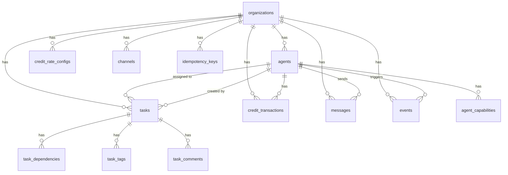

# BikiniBottom — Database Schema

**Version:** 1.0  
**Date:** February 6, 2026  
**Database:** PostgreSQL 16  
**ORM:** TypeORM (code-first entities → migrations)

---

## Conventions

- All tables include `id` (UUID v4, PK), `created_at`, `updated_at` (timestamptz, auto-managed)
- All tables include `org_id` (FK → organizations) for multi-tenancy
- All queries MUST be scoped by `org_id` via NestJS middleware
- Soft deletes via `deleted_at` (timestamptz, nullable) where noted
- Snake_case for columns, PascalCase for TypeORM entities
- Indexes on all foreign keys and commonly filtered columns
- `JSONB` for flexible metadata; typed interfaces in TypeScript

## Entity Relationship Diagram



---

## Tables

### `organizations`

Multi-tenancy root. Even single-user deployments have one org.

| Column     | Type         | Constraints                   | Description                                     |
| ---------- | ------------ | ----------------------------- | ----------------------------------------------- |
| id         | uuid         | PK, DEFAULT gen_random_uuid() |                                                 |
| name       | varchar(255) | NOT NULL                      | Organization display name                       |
| slug       | varchar(100) | NOT NULL, UNIQUE              | URL-safe identifier                             |
| settings   | jsonb        | DEFAULT '{}'                  | Org-level configuration (rate tables, defaults) |
| created_at | timestamptz  | NOT NULL, DEFAULT now()       |                                                 |
| updated_at | timestamptz  | NOT NULL, DEFAULT now()       |                                                 |

**Indexes:** `UNIQUE(slug)`

---

### `agents`

Registered agent identities. Created exclusively by the Talent Agent (or bootstrap).

| Column              | Type         | Constraints                       | Description                                                            |
| ------------------- | ------------ | --------------------------------- | ---------------------------------------------------------------------- |
| id                  | uuid         | PK, DEFAULT gen_random_uuid()     |                                                                        |
| org_id              | uuid         | NOT NULL, FK → organizations      |                                                                        |
| agent_id            | varchar(100) | NOT NULL                          | Human-readable agent identifier (e.g., "builder")                      |
| name                | varchar(255) | NOT NULL                          | Display name                                                           |
| level               | smallint     | NOT NULL, DEFAULT 1, CHECK (1–10) | Promotion ladder level                                                 |
| model               | varchar(100) | NOT NULL, DEFAULT 'sonnet'        | Primary LLM model (founder defaults to 'opus')                         |
| status              | varchar(20)  | NOT NULL, DEFAULT 'active'        | active, suspended, revoked                                             |
| role                | varchar(50)  | NOT NULL, DEFAULT 'worker'        | worker, hr (Talent Agent), founder, admin                              |
| management_fee_pct  | smallint     | NOT NULL, DEFAULT 0, CHECK (0–50) | % of delegated task credits earned on completion (founder default: 20) |
| current_balance     | integer      | NOT NULL, DEFAULT 0               | Materialized credit balance (updated atomically with ledger)           |
| budget_period_limit | integer      | NULL                              | Max credits spendable per budget period (NULL = unlimited)             |
| budget_period_spent | integer      | NOT NULL, DEFAULT 0               | Credits spent in current budget period                                 |
| budget_period_start | timestamptz  | NULL                              | Start of current budget period                                         |
| hmac_secret_enc     | bytea        | NOT NULL                          | AES-256-GCM encrypted signing secret                                   |
| metadata            | jsonb        | DEFAULT '{}'                      | Arbitrary agent metadata                                               |
| deleted_at          | timestamptz  | NULL                              | Soft delete                                                            |
| created_at          | timestamptz  | NOT NULL, DEFAULT now()           |                                                                        |
| updated_at          | timestamptz  | NOT NULL, DEFAULT now()           |                                                                        |

**Indexes:** `UNIQUE(org_id, agent_id)`, `INDEX(org_id, status)`, `INDEX(org_id, role)`

**Materialized Balance:** `current_balance` is the authoritative balance, updated atomically within the same DB transaction as `credit_transactions` inserts using `SELECT ... FOR UPDATE` on the agent row. This eliminates the race condition in the previous `ORDER BY created_at DESC LIMIT 1` pattern. The `credit_transactions` ledger remains the full audit trail for reconciliation.

**Budget Periods:** When `budget_period_limit` is set, `CreditsService` checks `budget_period_spent < budget_period_limit` before allowing debits. A scheduled job resets `budget_period_spent = 0` and advances `budget_period_start` at the configured interval (weekly/monthly via org settings).

**Founder Agent Defaults:** When `role = 'founder'`, the Talent Agent sets `model = 'opus'` and `management_fee_pct = 20`. The founder runs the most capable model for strategic orchestration and earns a management fee on delegated task completions. See Credit Earning Triggers below.

**Secret Storage:** `hmac_secret_enc` stores the HMAC signing secret encrypted with AES-256-GCM using a server-side key. The raw secret is generated once during registration, returned to the Talent Agent, and never exposed again. AES-256-GCM is fast enough for per-request decryption (bcrypt is not).

---

### `agent_capabilities`

Tags describing what an agent can do. Enables automated task routing.

| Column      | Type         | Constraints                   | Description                               |
| ----------- | ------------ | ----------------------------- | ----------------------------------------- |
| id          | uuid         | PK, DEFAULT gen_random_uuid() |                                           |
| org_id      | uuid         | NOT NULL, FK → organizations  |                                           |
| agent_id    | uuid         | NOT NULL, FK → agents         |                                           |
| capability  | varchar(100) | NOT NULL                      | e.g., "coding", "typescript", "marketing" |
| proficiency | varchar(20)  | DEFAULT 'standard'            | basic, standard, expert                   |
| created_at  | timestamptz  | NOT NULL, DEFAULT now()       |                                           |

**Indexes:** `UNIQUE(agent_id, capability)`, `INDEX(org_id, capability)`

---

### `tasks`

Core work unit. Inspired by Linear's issue model.

| Column            | Type         | Constraints                   | Description                                                  |
| ----------------- | ------------ | ----------------------------- | ------------------------------------------------------------ |
| id                | uuid         | PK, DEFAULT gen_random_uuid() |                                                              |
| org_id            | uuid         | NOT NULL, FK → organizations  |                                                              |
| identifier        | varchar(20)  | NOT NULL                      | Human-readable ID (e.g., "TASK-42"), auto-generated          |
| title             | varchar(500) | NOT NULL                      |                                                              |
| description       | text         | NULL                          | Markdown-supported                                           |
| status            | varchar(20)  | NOT NULL, DEFAULT 'backlog'   | backlog, todo, in_progress, review, done, blocked, cancelled |
| priority          | varchar(10)  | NOT NULL, DEFAULT 'normal'    | urgent, high, normal, low                                    |
| assignee_id       | uuid         | NULL, FK → agents             | Currently assigned agent                                     |
| creator_id        | uuid         | NOT NULL, FK → agents         | Agent that created the task                                  |
| parent_task_id    | uuid         | NULL, FK → tasks              | Subtask relationship                                         |
| approval_required | boolean      | NOT NULL, DEFAULT false       | Requires human approval to transition past review            |
| approved_by       | varchar(255) | NULL                          | Identity of approver (human or high-level agent)             |
| approved_at       | timestamptz  | NULL                          |                                                              |
| due_date          | timestamptz  | NULL                          |                                                              |
| completed_at      | timestamptz  | NULL                          | Set when status → done                                       |
| metadata          | jsonb        | DEFAULT '{}'                  | Arbitrary task metadata                                      |
| deleted_at        | timestamptz  | NULL                          | Soft delete                                                  |
| created_at        | timestamptz  | NOT NULL, DEFAULT now()       |                                                              |
| updated_at        | timestamptz  | NOT NULL, DEFAULT now()       |                                                              |

**Indexes:** `UNIQUE(org_id, identifier)`, `INDEX(org_id, status)`, `INDEX(org_id, assignee_id)`, `INDEX(org_id, priority)`, `INDEX(org_id, status, assignee_id)`, `INDEX(parent_task_id)`

**Status Transition Rules (enforced in application):**

```
backlog    → todo, cancelled
todo       → in_progress, blocked, cancelled
in_progress → review, blocked, cancelled
review     → done (may require approval), in_progress (rejected), cancelled
blocked    → todo, in_progress, cancelled
done       → (terminal, immutable)
cancelled  → (terminal, immutable)
```

---

### `task_dependencies`

Junction table for task blocking relationships.

| Column           | Type        | Constraints                   | Description                       |
| ---------------- | ----------- | ----------------------------- | --------------------------------- |
| id               | uuid        | PK, DEFAULT gen_random_uuid() |                                   |
| org_id           | uuid        | NOT NULL, FK → organizations  |                                   |
| blocking_task_id | uuid        | NOT NULL, FK → tasks          | The task that must complete first |
| blocked_task_id  | uuid        | NOT NULL, FK → tasks          | The task that is waiting          |
| created_at       | timestamptz | NOT NULL, DEFAULT now()       |                                   |

**Indexes:** `UNIQUE(blocking_task_id, blocked_task_id)`, `INDEX(blocked_task_id)`, `INDEX(blocking_task_id)`

**Constraint:** Application must prevent circular dependencies.

---

### `task_tags`

Flexible tagging for tasks.

| Column     | Type         | Constraints                   | Description                          |
| ---------- | ------------ | ----------------------------- | ------------------------------------ |
| id         | uuid         | PK, DEFAULT gen_random_uuid() |                                      |
| org_id     | uuid         | NOT NULL, FK → organizations  |                                      |
| task_id    | uuid         | NOT NULL, FK → tasks          |                                      |
| tag        | varchar(100) | NOT NULL                      | e.g., "deploy", "frontend", "urgent" |
| created_at | timestamptz  | NOT NULL, DEFAULT now()       |                                      |

**Indexes:** `UNIQUE(task_id, tag)`, `INDEX(org_id, tag)`

---

### `task_comments`

Comments on tasks. Supports both agent and human comments.

| Column            | Type        | Constraints                   | Description        |
| ----------------- | ----------- | ----------------------------- | ------------------ |
| id                | uuid        | PK, DEFAULT gen_random_uuid() |                    |
| org_id            | uuid        | NOT NULL, FK → organizations  |                    |
| task_id           | uuid        | NOT NULL, FK → tasks          |                    |
| author_id         | uuid        | NOT NULL, FK → agents         |                    |
| body              | text        | NOT NULL                      | Markdown-supported |
| parent_comment_id | uuid        | NULL, FK → task_comments      | Thread support     |
| created_at        | timestamptz | NOT NULL, DEFAULT now()       |                    |
| updated_at        | timestamptz | NOT NULL, DEFAULT now()       |                    |

**Indexes:** `INDEX(task_id, created_at)`, `INDEX(parent_comment_id)`

---

### `credit_transactions`

Append-only ledger. Every credit movement is a row. NEVER update or delete.

| Column           | Type          | Constraints                   | Description                                                                            |
| ---------------- | ------------- | ----------------------------- | -------------------------------------------------------------------------------------- |
| id               | uuid          | PK, DEFAULT gen_random_uuid() |                                                                                        |
| org_id           | uuid          | NOT NULL, FK → organizations  |                                                                                        |
| agent_id         | uuid          | NOT NULL, FK → agents         | Agent involved                                                                         |
| type             | varchar(10)   | NOT NULL                      | 'credit' (earning) or 'debit' (spending)                                               |
| amount           | integer       | NOT NULL, CHECK (amount > 0)  | Always positive; type indicates direction                                              |
| balance_after    | integer       | NOT NULL                      | Running balance snapshot after this transaction                                        |
| reason           | varchar(500)  | NOT NULL                      | Human/agent-readable description                                                       |
| trigger_type     | varchar(100)  | NULL                          | Rate config trigger that caused this (e.g., "task.done", "task.delegated", "mgmt_fee") |
| trigger_event_id | uuid          | NULL, FK → events             | Event that caused this transaction (null for manual adjustments)                       |
| source_task_id   | uuid          | NULL, FK → tasks              | Task associated with this credit (enables management fee tracing)                      |
| source_agent_id  | uuid          | NULL, FK → agents             | For mgmt fees: the worker agent whose completion triggered the fee                     |
| litellm_cost_usd | numeric(10,6) | NULL                          | Actual USD cost from LiteLLM (for model spend debits)                                  |
| idempotency_key  | uuid          | NULL, UNIQUE                  | Client-provided dedup key                                                              |
| metadata         | jsonb         | DEFAULT '{}'                  | Additional context (model, token count, etc.)                                          |
| created_at       | timestamptz   | NOT NULL, DEFAULT now()       |                                                                                        |

**Indexes:** `INDEX(org_id, agent_id, created_at)`, `INDEX(org_id, created_at)`, `UNIQUE(idempotency_key) WHERE idempotency_key IS NOT NULL`, `INDEX(trigger_event_id)`, `INDEX(source_task_id)`

**Atomic Balance Update Pattern (replaces previous ORDER BY LIMIT 1 query):**

```sql
-- All credit mutations use this pattern within a single transaction:
BEGIN;
  -- Lock the agent row to prevent concurrent balance corruption
  SELECT current_balance FROM agents
  WHERE id = $agent_id AND org_id = $org_id
  FOR UPDATE;

  -- For debits: verify sufficient balance
  -- For budget-limited agents: verify budget_period_spent + amount <= budget_period_limit

  -- Insert ledger row with balance_after = current_balance ± amount
  INSERT INTO credit_transactions (org_id, agent_id, type, amount, balance_after, ...)
  VALUES ($org_id, $agent_id, $type, $amount, $new_balance, ...);

  -- Update materialized balance atomically
  UPDATE agents SET current_balance = $new_balance,
    budget_period_spent = budget_period_spent + (CASE WHEN $type = 'debit' THEN $amount ELSE 0 END)
  WHERE id = $agent_id;
COMMIT;
```

**Reconciliation Invariant (run periodically):**

```sql
-- Verify materialized balances match ledger
SELECT a.agent_id, a.current_balance AS materialized,
  (SUM(CASE WHEN ct.type = 'credit' THEN ct.amount ELSE -ct.amount END)) AS computed
FROM agents a
JOIN credit_transactions ct ON ct.agent_id = a.id
WHERE a.org_id = $org_id
GROUP BY a.id
HAVING a.current_balance != SUM(CASE WHEN ct.type = 'credit' THEN ct.amount ELSE -ct.amount END);
-- Should return 0 rows. Any results indicate corruption.
```

**Ledger Archival:** After 90 days, old transactions can be archived to a `credit_transactions_archive` table (same schema) since `current_balance` on agents is the authoritative balance. The archive retains the full audit trail without bloating active queries.

---

### `credit_rate_configs`

Per-org configurable earning/spending rates. Includes orchestration incentives for the founding agent.

| Column              | Type          | Constraints                   | Description                                                                        |
| ------------------- | ------------- | ----------------------------- | ---------------------------------------------------------------------------------- |
| id                  | uuid          | PK, DEFAULT gen_random_uuid() |                                                                                    |
| org_id              | uuid          | NOT NULL, FK → organizations  |                                                                                    |
| trigger_type        | varchar(100)  | NOT NULL                      | e.g., "task.done", "task.delegated", "task.reviewed", "model.opus", "model.sonnet" |
| direction           | varchar(10)   | NOT NULL                      | 'credit' (earning) or 'debit' (spending)                                           |
| amount              | integer       | NULL                          | Fixed credits to award/charge (NULL if using dynamic pricing)                      |
| amount_mode         | varchar(20)   | NOT NULL, DEFAULT 'fixed'     | 'fixed' (use amount) or 'dynamic' (compute from LiteLLM cost)                      |
| usd_to_credits_rate | numeric(10,4) | NULL                          | For dynamic mode: $1 USD = N credits (e.g., 100.0 means $0.01 = 1 credit)          |
| description         | varchar(255)  | NULL                          | Human-readable description                                                         |
| active              | boolean       | NOT NULL, DEFAULT true        |                                                                                    |
| created_at          | timestamptz   | NOT NULL, DEFAULT now()       |                                                                                    |
| updated_at          | timestamptz   | NOT NULL, DEFAULT now()       |                                                                                    |

**Indexes:** `UNIQUE(org_id, trigger_type, direction)`, `INDEX(org_id, active)`

**Default Rate Table (seeded on org creation):**

| trigger_type   | direction | amount | mode    | description                                                                |
| -------------- | --------- | ------ | ------- | -------------------------------------------------------------------------- |
| task.done      | credit    | 25     | fixed   | Worker earns credits for completing a task                                 |
| task.delegated | credit    | 2      | fixed   | Founder earns credits for creating & assigning a task                      |
| task.reviewed  | credit    | 3      | fixed   | Reviewer earns credits for quality gate actions                            |
| task.approved  | credit    | 5      | fixed   | Approver earns credits for approval decisions                              |
| mgmt_fee       | credit    | NULL   | dynamic | Founder earns % of task completion credits (uses agent.management_fee_pct) |
| model.opus     | debit     | NULL   | dynamic | Actual Opus API cost from LiteLLM × usd_to_credits_rate                    |
| model.sonnet   | debit     | NULL   | dynamic | Actual Sonnet API cost from LiteLLM × usd_to_credits_rate                  |
| model.haiku    | debit     | NULL   | dynamic | Actual Haiku API cost from LiteLLM × usd_to_credits_rate                   |
| credits.manual | credit    | NULL   | fixed   | Manual credit adjustment by admin                                          |

**Management Fee Flow:** When a task transitions to `done`, the system:

1. Awards the assignee agent `task.done` credits (e.g., 25)
2. Looks up the task's `created_by` agent
3. If that agent has `management_fee_pct > 0`, awards `floor(25 * 0.20) = 5` credits as a `mgmt_fee` transaction
4. Both transactions reference the same `source_task_id` for audit tracing

**Dynamic Pricing Flow:** When LiteLLM reports a model call cost:

1. Look up rate config where `trigger_type = 'model.<model_name>'` and `amount_mode = 'dynamic'`
2. Compute debit: `ceil(litellm_cost_usd * usd_to_credits_rate)`
3. Store both `amount` (computed credits) and `litellm_cost_usd` (raw cost) on the transaction

---

### `channels`

Message channels for organizing communication.

| Column     | Type         | Constraints                   | Description                                             |
| ---------- | ------------ | ----------------------------- | ------------------------------------------------------- |
| id         | uuid         | PK, DEFAULT gen_random_uuid() |                                                         |
| org_id     | uuid         | NOT NULL, FK → organizations  |                                                         |
| name       | varchar(255) | NOT NULL                      | Channel name                                            |
| type       | varchar(20)  | NOT NULL                      | 'task' (per-task), 'agent' (DM), 'broadcast', 'general' |
| task_id    | uuid         | NULL, FK → tasks              | Associated task (for task channels)                     |
| metadata   | jsonb        | DEFAULT '{}'                  |                                                         |
| created_at | timestamptz  | NOT NULL, DEFAULT now()       |                                                         |
| updated_at | timestamptz  | NOT NULL, DEFAULT now()       |                                                         |

**Indexes:** `UNIQUE(org_id, name)`, `INDEX(org_id, type)`, `INDEX(task_id)`

---

### `messages`

Structured messages between agents.

| Column            | Type        | Constraints                   | Description                           |
| ----------------- | ----------- | ----------------------------- | ------------------------------------- |
| id                | uuid        | PK, DEFAULT gen_random_uuid() |                                       |
| org_id            | uuid        | NOT NULL, FK → organizations  |                                       |
| channel_id        | uuid        | NOT NULL, FK → channels       |                                       |
| sender_id         | uuid        | NOT NULL, FK → agents         |                                       |
| type              | varchar(20) | NOT NULL, DEFAULT 'text'      | text, handoff, status_update, request |
| body              | text        | NOT NULL                      | Message content (markdown)            |
| parent_message_id | uuid        | NULL, FK → messages           | Thread support                        |
| metadata          | jsonb       | DEFAULT '{}'                  | Type-specific payload                 |
| created_at        | timestamptz | NOT NULL, DEFAULT now()       |                                       |

**Indexes:** `INDEX(channel_id, created_at)`, `INDEX(org_id, sender_id)`, `INDEX(parent_message_id)`

---

### `events`

Append-only audit log. Every state change in the system creates an event. NEVER update or delete.

| Column      | Type         | Constraints                   | Description                                           |
| ----------- | ------------ | ----------------------------- | ----------------------------------------------------- |
| id          | uuid         | PK, DEFAULT gen_random_uuid() |                                                       |
| org_id      | uuid         | NOT NULL, FK → organizations  |                                                       |
| type        | varchar(100) | NOT NULL                      | Dotted event type (e.g., "task.created")              |
| actor_id    | uuid         | NOT NULL, FK → agents         | Agent that caused this event                          |
| entity_type | varchar(50)  | NOT NULL                      | "task", "agent", "credit", "message"                  |
| entity_id   | uuid         | NOT NULL                      | ID of the affected entity                             |
| data        | jsonb        | NOT NULL                      | Event-specific payload (before/after for transitions) |
| severity    | varchar(10)  | NOT NULL, DEFAULT 'info'      | info, warning, error                                  |
| reasoning   | varchar(500) | NULL                          | Optional agent reasoning snapshot                     |
| created_at  | timestamptz  | NOT NULL, DEFAULT now()       |                                                       |

**Indexes:** `INDEX(org_id, type, created_at)`, `INDEX(org_id, entity_type, entity_id)`, `INDEX(org_id, actor_id, created_at)`, `INDEX(org_id, created_at)`

**Event Types:**

```
task.created, task.updated, task.transitioned, task.assigned, task.commented
task.dependency_added, task.dependency_removed, task.approved
task.delegated, task.reviewed
credit.earned, credit.spent, credit.adjusted, credit.mgmt_fee
credit.budget_reset, credit.budget_exceeded
agent.registered, agent.updated, agent.revoked, agent.suspended
message.sent
channel.created
org.settings_updated
```

---

### `idempotency_keys`

Request deduplication. Stores responses for replay on retry.

| Column        | Type         | Constraints                   | Description                     |
| ------------- | ------------ | ----------------------------- | ------------------------------- |
| id            | uuid         | PK, DEFAULT gen_random_uuid() |                                 |
| key           | uuid         | NOT NULL, UNIQUE              | Client-provided idempotency key |
| org_id        | uuid         | NOT NULL, FK → organizations  |                                 |
| agent_id      | uuid         | NOT NULL, FK → agents         |                                 |
| method        | varchar(10)  | NOT NULL                      | HTTP method                     |
| path          | varchar(500) | NOT NULL                      | Request path                    |
| status_code   | smallint     | NOT NULL                      | Response status code            |
| response_body | jsonb        | NOT NULL                      | Cached response                 |
| expires_at    | timestamptz  | NOT NULL                      | TTL (default: created_at + 24h) |
| created_at    | timestamptz  | NOT NULL, DEFAULT now()       |                                 |

**Indexes:** `UNIQUE(key)`, `INDEX(expires_at)` (for cleanup job)

**Cleanup:** Periodic job deletes rows where `expires_at < now()`.

---

### `nonces`

HMAC replay prevention. Short-lived nonce storage.

| Column     | Type        | Constraints             | Description                 |
| ---------- | ----------- | ----------------------- | --------------------------- |
| nonce      | varchar(64) | PK                      | The nonce value             |
| agent_id   | uuid        | NOT NULL                | Agent that used this nonce  |
| expires_at | timestamptz | NOT NULL                | nonce creation + 10 minutes |
| created_at | timestamptz | NOT NULL, DEFAULT now() |                             |

**Indexes:** `INDEX(expires_at)` (for cleanup)

**Cleanup:** Periodic job deletes rows where `expires_at < now()`.

---

## Migration Strategy

1. TypeORM generates migrations from entity definitions (`typeorm migration:generate`)
2. Migrations run automatically on API container startup in development
3. Production migrations run via explicit CLI command before deployment
4. All migrations are idempotent and reversible
5. Schema changes require a migration file — never modify the database directly
6. The initial migration creates all Phase 1 tables in a single transaction

## TypeORM Entity Naming Convention

| Database            | TypeORM Entity    | File                         |
| ------------------- | ----------------- | ---------------------------- |
| organizations       | Organization      | organization.entity.ts       |
| agents              | Agent             | agent.entity.ts              |
| agent_capabilities  | AgentCapability   | agent-capability.entity.ts   |
| tasks               | Task              | task.entity.ts               |
| task_dependencies   | TaskDependency    | task-dependency.entity.ts    |
| task_tags           | TaskTag           | task-tag.entity.ts           |
| task_comments       | TaskComment       | task-comment.entity.ts       |
| credit_transactions | CreditTransaction | credit-transaction.entity.ts |
| credit_rate_configs | CreditRateConfig  | credit-rate-config.entity.ts |
| channels            | Channel           | channel.entity.ts            |
| messages            | Message           | message.entity.ts            |
| events              | Event             | event.entity.ts              |
| idempotency_keys    | IdempotencyKey    | idempotency-key.entity.ts    |
| nonces              | Nonce             | nonce.entity.ts              |
