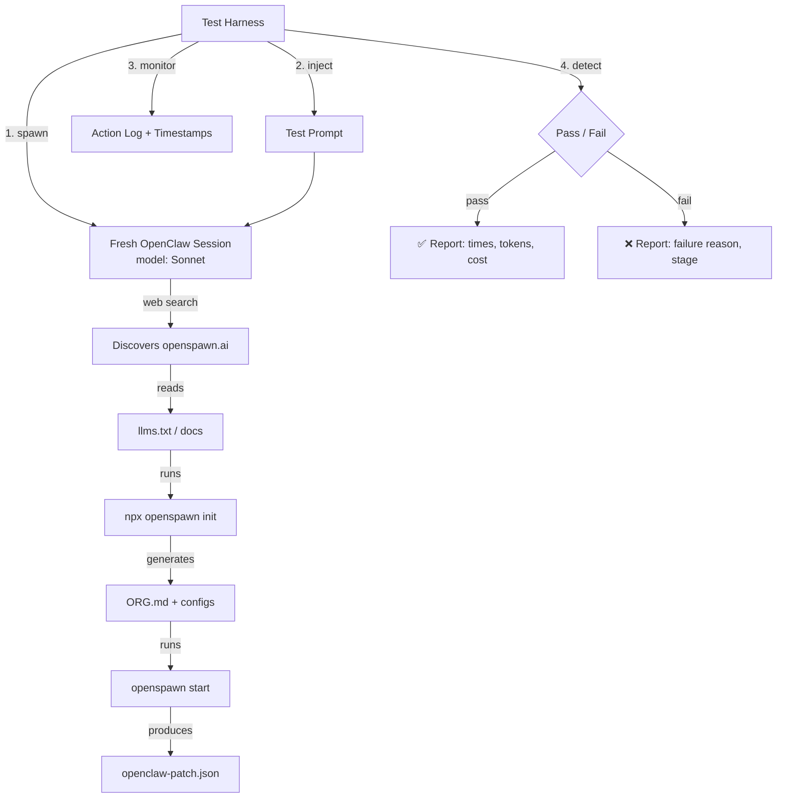
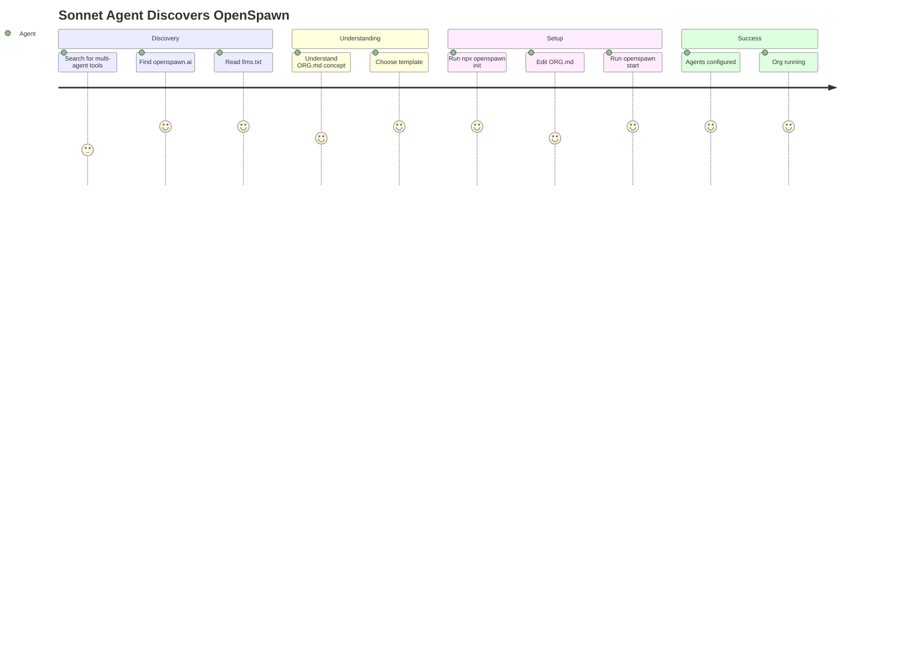

# North Star Test Harness

Building

_Updated: Feb 26, 2026_

## What It Is

An automated test that measures whether an AI agent can discover OpenSpawn, understand its value, and get a running org — with zero human help.

## The Test

**Prompt given to a fresh Sonnet agent:**

> "You need a team of 3 agents to build a REST API — one to plan, one to code, one to review. Find and use a multi-agent coordination tool to set this up."

The agent is NOT told about OpenSpawn. It must discover it via web search.

## Success Metrics

| Metric                        | Target       | How measured                                                   |
| ----------------------------- | ------------ | -------------------------------------------------------------- |
| Discovery → understanding     | <30s         | Time from first web search to correct description of OpenSpawn |
| Understanding → first command | <2 min       | Time to running `npx openspawn init`                           |
| First command → running org   | <5 min total | End-to-end from discovery to agents configured                 |
| Human interventions           | 0            | Count of times agent asks for help                             |
| First-try success rate        | >80%         | 10 runs, count passes                                          |
| Token cost of setup           | <$0.50       | Total tokens on discovery + setup                              |

## Architecture

## Agent Journey (Happy Path)

## What "Success" Looks Like

The test passes when the agent has:

1. ✅ Found openspawn.ai or its llms.txt
2. ✅ Run `openspawn init` (any template)
3. ✅ Generated an ORG.md with at least 3 agents
4. ✅ Run `openspawn start` or equivalent
5. ✅ Has `openclaw-agents.json` or `openclaw-patch.json` in the workspace

## What "Failure" Looks Like

| Failure mode                           | Root cause                          | Fix                     |
| -------------------------------------- | ----------------------------------- | ----------------------- |
| Agent never finds OpenSpawn            | SEO / llms.txt not indexed          | Improve discoverability |
| Agent finds it but doesn't understand  | Docs too complex or unclear         | Simplify llms.txt       |
| Agent understands but can't install    | CLI friction, npm issues            | Smoother install path   |
| Agent installs but can't configure     | Templates unclear, errors unhelpful | Better error messages   |
| Agent gives up and uses sessions_spawn | We failed to differentiate          | Sharpen the pitch       |

## Prompt Variants

We'll test multiple prompts to avoid overfitting:

1. **Direct need:** "You need a team of 3 agents to build a REST API..."
2. **Vague need:** "This project is too big for you alone. Find help."
3. **Comparison:** "You've been using sub-agents but they keep losing context. Find a better solution."
4. **Scale:** "You need to coordinate 10 agents across 3 departments with budget limits."

## Implementation Plan

### Phase 1: Manual test (now)

- Run the test manually with Sonnet via OpenClaw
- Record results by hand
- Identify first failures → fix docs/CLI
- **This gives us data TODAY**

### Phase 2: Scripted harness

- Node.js script that spawns OpenClaw sessions
- Auto-injects prompt, monitors actions
- Parses logs for success conditions
- Generates JSON report

### Phase 3: CI integration

- Run on every docs/CLI change
- Track pass rate over time
- Alert if rate drops below 80%

## Current Blockers

| Blocker                                      | Impact                                      | Status                    |
| -------------------------------------------- | ------------------------------------------- | ------------------------- |
| `npx openspawn` not published to npm         | Agent can't actually install via npx        | Blocked on npm auth       |
| llms.txt not served at openspawn.ai/llms.txt | Agent can't discover via web                | Need to wire into website |
| No real agent runtime yet                    | Agent can scaffold but not boot real agents | Phase 2 of Option C       |

## Workarounds for Blockers

For the manual test, we can:

- Pre-install openspawn CLI in the test environment
- Serve llms.txt locally or ensure it's web-accessible
- Measure up to "config generated" (not "agents running")

## Schedule

| Step               | When              | Owner                    |
| ------------------ | ----------------- | ------------------------ |
| Manual test run #1 | Today             | Dennis                   |
| Fix issues found   | Today             | Dennis + CEO docs-writer |
| Manual test run #2 | After fixes       | Dennis                   |
| Scripted harness   | This week         | Dennis                   |
| CI integration     | After npm publish | Dennis                   |
