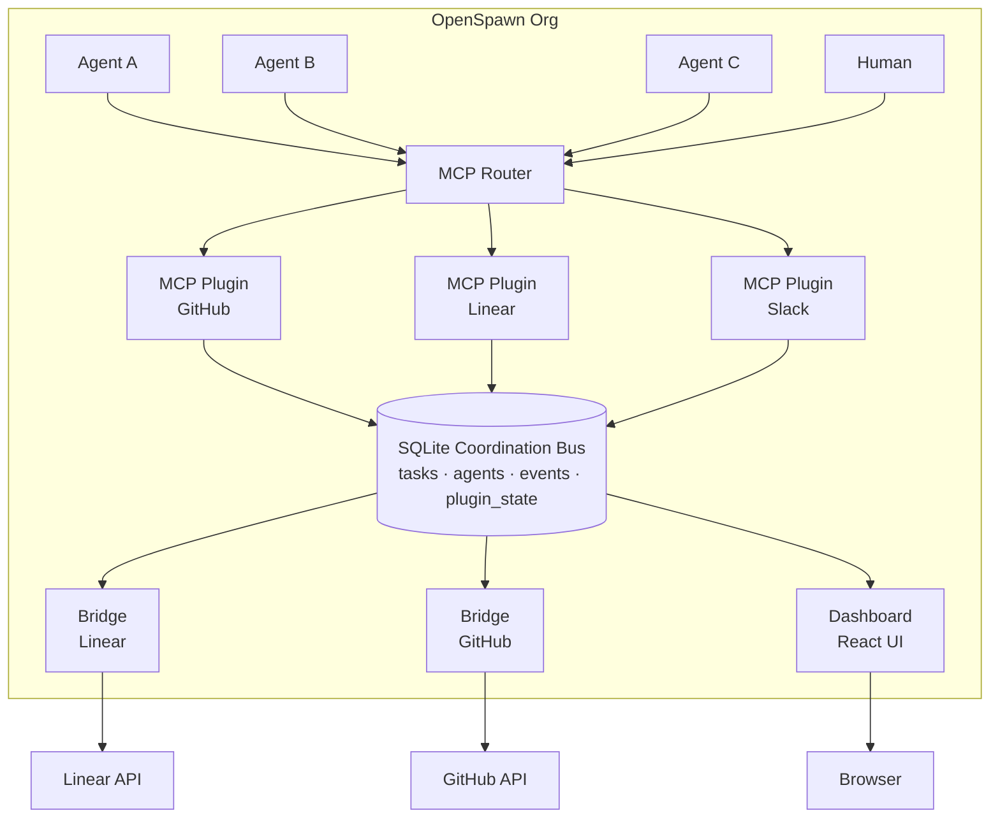
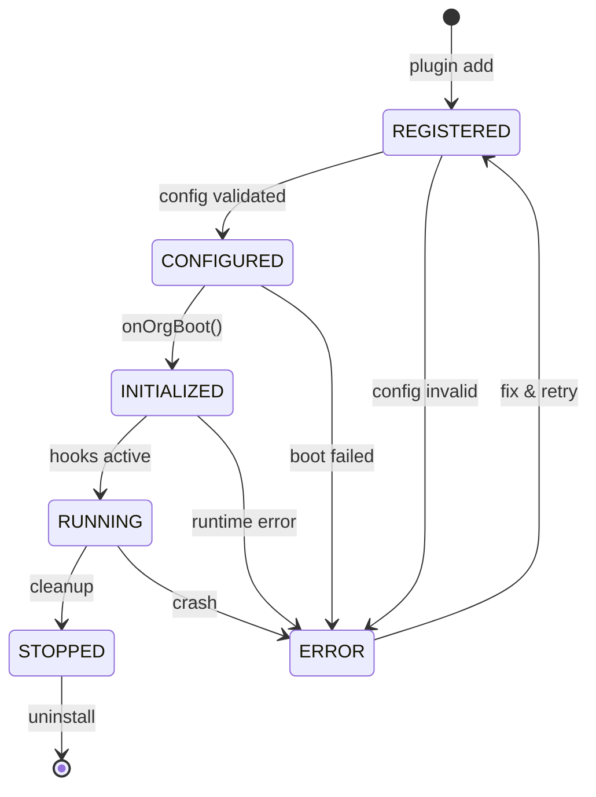

# OpenSpawn Plugin Architecture Specification

**Version:** 0.1.0-draft
**Date:** 2026-02-26
**Status:** RFC

---

## Table of Contents

1. [Overview](#1-overview)
2. [Plugin Types](#2-plugin-types)
3. [Plugin API Specification](#3-plugin-api-specification)
4. [Architecture Diagrams](#4-architecture-diagrams)
5. [SQLite Coordination Bus](#5-sqlite-coordination-bus)
6. [Plugin Categories & Tool Catalog](#6-plugin-categories--tool-catalog)
7. [ORG.md Integration](#7-orgmd-integration)
8. [Security Model](#8-security-model)
9. [Plugin Marketplace](#9-plugin-marketplace)
10. [Appendix](#10-appendix)

---

## 1. Overview

OpenSpawn is the operating system for agent organizations. Plugins are its app store — the extension mechanism through which agents gain capabilities, organizations connect to external tools, and dashboards visualize state.

### Design Principles

- **MCP-native**: Agents interact with plugins exclusively through MCP (Model Context Protocol) tool calls. No direct database access, no raw API calls.
- **SQLite as truth**: All coordination state flows through SQLite. It is the single source of truth and the event bus.
- **Composability**: Plugins can be simple (one MCP tool) or composite (MCP + bridge + dashboard). They compose freely.
- **Zero-trust by default**: Plugins run sandboxed. Agents only access plugins they're explicitly granted. Secrets never leak across boundaries.

---

## 2. Plugin Types

### 2.1 MCP Plugins (Primary)

The native integration path. An MCP plugin exposes tools that agents call directly via the MCP protocol.

```
Agent ──MCP──▶ Plugin ──API──▶ External Service
```

**Examples:** An agent calls `github.create_issue(title, body)` — the MCP plugin handles auth, API calls, and returns structured results.

**Interface:**

```typescript
interface McpPlugin {
  type: "mcp";
  tools: ToolDefinition[]; // MCP tool schemas
  resources?: ResourceDefinition[]; // MCP resources (optional)
  prompts?: PromptDefinition[]; // MCP prompt templates (optional)
}
```

### 2.2 Bridge Plugins

Bidirectional sync adapters between external tools and OpenSpawn's SQLite coordination layer. Bridges run continuously, watching for changes on both sides.

```
External Service ◀──sync──▶ Bridge Plugin ◀──read/write──▶ SQLite
```

**Examples:** Linear issues sync to SQLite `tasks` table. When an agent completes a task in SQLite, the bridge updates Linear.

**Interface:**

```typescript
interface BridgePlugin {
  type: "bridge";
  direction: "inbound" | "outbound" | "bidirectional";
  syncInterval?: number; // ms, or event-driven if omitted
  tables: string[]; // SQLite tables this bridge touches
  onExternalChange(event: ExternalEvent): Promise<SqliteOp[]>;
  onInternalChange(event: SqliteChangeEvent): Promise<ExternalOp[]>;
}
```

### 2.3 Dashboard Plugins

React components that visualize organization state. They read from SQLite (read-only) and render in the OpenSpawn dashboard.

```
SQLite ──read──▶ Dashboard Plugin ──render──▶ Browser
```

**Interface:**

```typescript
interface DashboardPlugin {
  type: "dashboard";
  panels: PanelDefinition[]; // Named UI panels
  routes?: RouteDefinition[]; // Optional dedicated pages
  refreshInterval?: number; // Auto-refresh rate in ms
}
```

### 2.4 Composite Plugins

The most powerful pattern. A single plugin package combines MCP tools, bridge sync, and dashboard visualization.

**Example — GitHub Composite Plugin:**

- **MCP**: `github.create_pr`, `github.review`, `github.merge`
- **Bridge**: Syncs issues, PRs, and reviews to SQLite
- **Dashboard**: PR status board, review queue, merge activity

**Interface:**

```typescript
interface CompositePlugin {
  type: "composite";
  mcp?: McpPlugin;
  bridge?: BridgePlugin;
  dashboard?: DashboardPlugin;
}
```

---

## 3. Plugin API Specification

### 3.1 Registration

Every plugin must export a `register()` function that returns its manifest:

```typescript
function register(): PluginManifest {
  return {
    id: "github",
    name: "GitHub",
    version: "1.0.0",
    type: "composite",            // "mcp" | "bridge" | "dashboard" | "composite"
    description: "GitHub integration for code, issues, and PRs",
    author: "openspawn",
    license: "MIT",
    tier: "official",             // "official" | "community" | "experimental"

    // Required configuration keys
    config: {
      repo: { type: "string", required: true, description: "owner/repo" },
      branch: { type: "string", default: "main" },
    },

    // Required secrets
    secrets: ["GITHUB_TOKEN"],

    // Permissions this plugin needs
    permissions: ["sqlite:read", "sqlite:write:tasks", "network:api.github.com"],

    // Plugin capabilities
    capabilities: {
      mcp: { tools: [...], resources: [...] },
      bridge: { direction: "bidirectional", tables: ["tasks", "prs"] },
      dashboard: { panels: ["pr-board", "issue-tracker"] },
    },
  };
}
```

### 3.2 Lifecycle Hooks

Plugins can subscribe to organizational lifecycle events:

| Hook                              | Trigger                         | Use Case                             |
| --------------------------------- | ------------------------------- | ------------------------------------ |
| `onOrgBoot`                       | Organization starts up          | Initialize sync, validate config     |
| `onAgentHire(agent)`              | New agent added to org          | Grant tool access, create accounts   |
| `onAgentFire(agent)`              | Agent removed from org          | Revoke access, archive data          |
| `onTaskCreate(task)`              | Task created in SQLite          | Sync to external PM tool             |
| `onTaskComplete(task)`            | Task marked complete            | Update external tool, trigger deploy |
| `onEscalation(escalation)`        | Issue escalated to human        | Send notification via comms plugin   |
| `onMessage(message)`              | Inter-agent or human message    | Log, analyze, route                  |
| `onBudgetExceeded(agent, budget)` | Agent exceeds token/cost budget | Alert, throttle, pause agent         |

```typescript
interface PluginHooks {
  onOrgBoot?(ctx: OrgContext): Promise<void>;
  onAgentHire?(agent: AgentDef, ctx: OrgContext): Promise<void>;
  onAgentFire?(agent: AgentDef, ctx: OrgContext): Promise<void>;
  onTaskCreate?(task: Task, ctx: OrgContext): Promise<void>;
  onTaskComplete?(task: Task, ctx: OrgContext): Promise<void>;
  onEscalation?(escalation: Escalation, ctx: OrgContext): Promise<void>;
  onMessage?(message: Message, ctx: OrgContext): Promise<void>;
  onBudgetExceeded?(agent: AgentDef, budget: BudgetInfo, ctx: OrgContext): Promise<void>;
}
```

### 3.3 Configuration

Plugins are configured through two mechanisms:

**ORG.md** (human-readable, checked into repo):

```markdown
## Plugins

- github: repo=openspawn/openspawn, branch=main
- linear: team=SPAWN, project=Core
- slack: channel=#agents
```

**openspawn.config.yaml** (machine-readable, full control):

```yaml
plugins:
  github:
    repo: openspawn/openspawn
    branch: main
    sync:
      issues: true
      prs: true
      interval: 30s
    dashboard:
      panels: [pr-board]
  linear:
    team: SPAWN
    project: Core
    sync:
      bidirectional: true
```

ORG.md takes precedence for simple key-value config. The YAML file handles complex/nested configuration. Both are merged at boot.

### 3.4 Secrets Management

Secrets are **never** stored in ORG.md or config files.

```
openspawn secret set GITHUB_TOKEN ghp_xxxxx
openspawn secret set LINEAR_API_KEY lin_xxxxx
```

Secrets are stored encrypted at rest in `~/.openspawn/secrets.enc` and injected into plugin context at runtime. Plugins access them via `ctx.secret("GITHUB_TOKEN")` — never as environment variables or plaintext files.

---

## 4. Architecture Diagrams

### 4.1 System Overview



### 4.2 Plugin Registration Flow

```
┌──────────────┐     ┌──────────────────┐     ┌──────────────┐
│   CLI        │     │  Plugin Registry │     │   Plugin      │
│              │     │                  │     │   Package     │
└──────┬───────┘     └────────┬─────────┘     └──────┬───────┘
       │                      │                      │
       │  plugin add github   │                      │
       ├─────────────────────▶│                      │
       │                      │  fetch manifest      │
       │                      ├─────────────────────▶│
       │                      │◀─────────────────────┤
       │                      │  PluginManifest      │
       │                      │                      │
       │  prompt for config   │                      │
       │◀─────────────────────┤                      │
       │  repo=openspawn/...  │                      │
       ├─────────────────────▶│                      │
       │                      │                      │
       │  prompt for secrets  │                      │
       │◀─────────────────────┤                      │
       │  GITHUB_TOKEN=ghp_.. │                      │
       ├─────────────────────▶│                      │
       │                      │                      │
       │                      │  register()          │
       │                      ├─────────────────────▶│
       │                      │  validate & init     │
       │                      │◀─────────────────────┤
       │                      │                      │
       │  ✓ Plugin installed  │                      │
       │◀─────────────────────┤                      │
       │                      │                      │
```

### 4.3 Data Flow: Agent → External Service → Dashboard

```
Agent                MCP Plugin         SQLite              Bridge            External         Dashboard
  │                      │                 │                    │                 │                │
  │ github.create_pr()   │                 │                    │                 │                │
  ├─────────────────────▶│                 │                    │                 │                │
  │                      │ POST /pulls     │                    │                 │                │
  │                      ├────────────────────────────────────────────────────────▶                │
  │                      │◀───────────────────────────────────────────────────────┤                │
  │                      │ PR #42 created  │                    │                 │                │
  │                      │                 │                    │                 │                │
  │                      │ INSERT pr       │                    │                 │                │
  │                      ├────────────────▶│                    │                 │                │
  │  ✓ PR #42            │                 │                    │                 │                │
  │◀─────────────────────┤                 │                    │                 │                │
  │                      │                 │                    │                 │                │
  │                      │                 │ change event       │                 │                │
  │                      │                 ├───────────────────▶│                 │                │
  │                      │                 │                    │ (no-op: same)   │                │
  │                      │                 │                    │                 │                │
  │                      │                 │ SELECT prs         │                 │                │
  │                      │                 │◀────────────────────────────────────────────────────┤
  │                      │                 ├────────────────────────────────────────────────────▶│
  │                      │                 │                    │                 │   render PR   │
  │                      │                 │                    │                 │   board       │
```

### 4.4 Bridge Sync Pattern

```
┌─────────────────┐                              ┌─────────────────┐
│  External Tool  │                              │     SQLite      │
│   (e.g. Linear) │                              │                 │
└────────┬────────┘                              └────────┬────────┘
         │                                                │
         │         ┌──────────────────────┐               │
         │         │    Bridge Plugin     │               │
         │         │                      │               │
         │ webhook │  ┌────────────────┐  │  INSERT/      │
         ├────────▶│  │ Inbound Mapper │  │  UPDATE       │
         │         │  │ (normalize to  │──┼──────────────▶│
         │         │  │  SQLite schema)│  │               │
         │         │  └────────────────┘  │               │
         │         │                      │               │
         │         │  ┌────────────────┐  │  change       │
         │◀────────┼──│ Outbound Mapper│  │  event        │
         │  API    │  │ (normalize to  │◀─┼───────────────┤
         │  call   │  │  external API) │  │               │
         │         │  └────────────────┘  │               │
         │         │                      │               │
         │         │  ┌────────────────┐  │               │
         │         │  │ Conflict Res.  │  │               │
         │         │  │ (last-write or │  │               │
         │         │  │  manual merge) │  │               │
         │         │  └────────────────┘  │               │
         │         └──────────────────────┘               │
```

### 4.5 Plugin Lifecycle



---

## 5. SQLite Coordination Bus

SQLite is the coordination bus — the central nervous system of an OpenSpawn organization. Every plugin reads from and writes to SQLite. Agents never touch it directly; they go through MCP tools.

### 5.1 Core Tables

```sql
-- Plugin registry
CREATE TABLE plugins (
  id          TEXT PRIMARY KEY,
  name        TEXT NOT NULL,
  version     TEXT NOT NULL,
  type        TEXT NOT NULL CHECK(type IN ('mcp','bridge','dashboard','composite')),
  status      TEXT NOT NULL DEFAULT 'registered'
                CHECK(status IN ('registered','configured','initialized','running','stopped','error')),
  config      TEXT,           -- JSON
  installed_at TEXT NOT NULL DEFAULT (datetime('now')),
  updated_at  TEXT NOT NULL DEFAULT (datetime('now'))
);

-- Event log (audit trail for all plugin activity)
CREATE TABLE events (
  id          INTEGER PRIMARY KEY AUTOINCREMENT,
  timestamp   TEXT NOT NULL DEFAULT (datetime('now')),
  plugin_id   TEXT NOT NULL,
  agent_id    TEXT,
  event_type  TEXT NOT NULL,   -- 'task.create', 'pr.merge', 'agent.hire', etc.
  payload     TEXT,            -- JSON
  FOREIGN KEY (plugin_id) REFERENCES plugins(id)
);

-- Plugin-managed state (generic KV per plugin)
CREATE TABLE plugin_state (
  plugin_id   TEXT NOT NULL,
  key         TEXT NOT NULL,
  value       TEXT,            -- JSON
  updated_at  TEXT NOT NULL DEFAULT (datetime('now')),
  PRIMARY KEY (plugin_id, key),
  FOREIGN KEY (plugin_id) REFERENCES plugins(id)
);

-- Tasks (core org table, plugins sync to/from here)
CREATE TABLE tasks (
  id          TEXT PRIMARY KEY,
  title       TEXT NOT NULL,
  description TEXT,
  status      TEXT NOT NULL DEFAULT 'todo'
                CHECK(status IN ('todo','in_progress','review','done','blocked')),
  assignee    TEXT,            -- agent_id
  source      TEXT,            -- plugin_id that created it
  external_id TEXT,            -- ID in external system (Linear issue, GitHub issue, etc.)
  priority    INTEGER DEFAULT 0,
  created_at  TEXT NOT NULL DEFAULT (datetime('now')),
  completed_at TEXT,
  metadata    TEXT             -- JSON for plugin-specific data
);

-- Agent registry
CREATE TABLE agents (
  id          TEXT PRIMARY KEY,
  name        TEXT NOT NULL,
  role        TEXT,
  status      TEXT NOT NULL DEFAULT 'active',
  plugins     TEXT,            -- JSON array of allowed plugin IDs
  hired_at    TEXT NOT NULL DEFAULT (datetime('now')),
  metadata    TEXT
);

-- Permission grants (agent ↔ plugin)
CREATE TABLE permissions (
  agent_id    TEXT NOT NULL,
  plugin_id   TEXT NOT NULL,
  tools       TEXT,            -- JSON array of allowed tool names, null = all
  granted_at  TEXT NOT NULL DEFAULT (datetime('now')),
  granted_by  TEXT,            -- who granted (human or agent)
  PRIMARY KEY (agent_id, plugin_id)
);
```

### 5.2 Event-Driven Coordination

SQLite change notifications drive the system:

1. **Agent calls MCP tool** → Plugin writes to SQLite → Change event fires
2. **Bridge receives webhook** → Bridge writes to SQLite → Change event fires
3. **Dashboard polls SQLite** → Renders current state (or uses SSE for live updates)

The `events` table serves as an append-only audit log. Every meaningful action is recorded. This enables:

- Full audit trail for compliance
- Replay/debugging of organization history
- Dashboard activity feeds
- Trigger chains (one event can cause plugin hooks to fire)

---

## 6. Plugin Categories & Tool Catalog

### 6.1 Knowledge Management

| Plugin         | Type       | Status       | Notes                                                                                                                                                             |
| -------------- | ---------- | ------------ | ----------------------------------------------------------------------------------------------------------------------------------------------------------------- |
| **Obsidian**   | Composite  | Official     | Vault sync, markdown-native. Bridge syncs vault ↔ SQLite. MCP tools: `obsidian.search`, `obsidian.create_note`, `obsidian.link`. Best for developer-focused orgs. |
| **Outline**    | Composite  | Official     | Team wiki with rich API. MCP tools: `outline.search`, `outline.create_doc`, `outline.update`. Bridge syncs collections. API-rich, great for agent authoring.      |
| **Notion**     | Composite  | Community    | Database-oriented. MCP tools: `notion.query_db`, `notion.create_page`. Bridge syncs databases. Complex API but powerful.                                          |
| **Confluence** | Bridge+MCP | Community    | Enterprise wiki. Heavier API, JIRA integration synergy.                                                                                                           |
| **BookStack**  | Bridge+MCP | Experimental | Open-source, self-hosted wiki. Simple API.                                                                                                                        |
| **WikiJS**     | Bridge+MCP | Experimental | Open-source, Git-backed wiki. Good for technical docs.                                                                                                            |

**Recommended default:** Obsidian (for solo/small orgs) or Outline (for team orgs).

### 6.2 Project Management

| Plugin            | Type       | Status       | Notes                                                                                                                                                         |
| ----------------- | ---------- | ------------ | ------------------------------------------------------------------------------------------------------------------------------------------------------------- |
| **Linear**        | Composite  | Official     | Best-in-class API. MCP tools: `linear.create_issue`, `linear.update_status`, `linear.list_cycles`. Bridge: bidirectional issue sync. Dashboard: sprint board. |
| **GitHub Issues** | Composite  | Official     | Bundled with GitHub plugin. Zero additional config for code-centric teams.                                                                                    |
| **Jira**          | Bridge+MCP | Community    | Enterprise. Complex but ubiquitous.                                                                                                                           |
| **Plane**         | Composite  | Community    | Open-source Linear alternative. Self-hosted.                                                                                                                  |
| **Taiga**         | Bridge+MCP | Experimental | Open-source, agile-focused.                                                                                                                                   |

**Recommended default:** Linear (SaaS) or Plane (self-hosted).

### 6.3 Kanban

| Plugin              | Type             | Status       | Notes                                                                                                 |
| ------------------- | ---------------- | ------------ | ----------------------------------------------------------------------------------------------------- |
| **Planka**          | Bridge+Dashboard | Community    | Self-hosted Trello clone. Clean API.                                                                  |
| **WeKan**           | Bridge+Dashboard | Community    | Open-source, mature.                                                                                  |
| **Vikunja**         | Bridge+Dashboard | Experimental | Modern, API-first.                                                                                    |
| **Built-in Kanban** | Dashboard        | Official     | Pure dashboard plugin reading from SQLite `tasks` table. Zero config. Renders task status as columns. |

**Recommended default:** Built-in Kanban (ships with OpenSpawn).

### 6.4 Code

| Plugin        | Type       | Status       | Notes                                                                                                                                                                                                                              |
| ------------- | ---------- | ------------ | ---------------------------------------------------------------------------------------------------------------------------------------------------------------------------------------------------------------------------------- |
| **GitHub**    | Composite  | Official     | Full integration: repos, PRs, issues, actions, code search. MCP tools: `github.create_pr`, `github.review_pr`, `github.merge`, `github.search_code`, `github.create_issue`. Bridge: PR/issue sync. Dashboard: PR board, CI status. |
| **GitLab**    | Composite  | Community    | Similar scope to GitHub. MCP tools mirror GitHub's.                                                                                                                                                                                |
| **Gitea**     | Composite  | Community    | Self-hosted, lightweight. Good for private orgs.                                                                                                                                                                                   |
| **Bitbucket** | Bridge+MCP | Experimental | Atlassian ecosystem.                                                                                                                                                                                                               |

**Recommended default:** GitHub.

### 6.5 Communication

| Plugin       | Type       | Status       | Notes                                                                                                                                                        |
| ------------ | ---------- | ------------ | ------------------------------------------------------------------------------------------------------------------------------------------------------------ |
| **Discord**  | Composite  | Official     | Native OpenClaw integration. MCP tools: `discord.send`, `discord.read_channel`, `discord.create_thread`. Bridge: message log sync. Dashboard: activity feed. |
| **Slack**    | Composite  | Official     | Enterprise standard. MCP tools: `slack.send`, `slack.search`, `slack.create_channel`. Bridge: message sync.                                                  |
| **Matrix**   | Bridge+MCP | Community    | Open protocol, self-hosted. Good for privacy-focused orgs.                                                                                                   |
| **Email**    | MCP        | Community    | SMTP/IMAP. MCP tools: `email.send`, `email.search`.                                                                                                          |
| **Telegram** | Bridge+MCP | Community    | Bot API. Good for notifications and mobile access.                                                                                                           |
| **Teams**    | Bridge+MCP | Experimental | Microsoft ecosystem.                                                                                                                                         |

**Recommended default:** Discord (for indie/startup) or Slack (for enterprise).

### 6.6 Deployment

| Plugin      | Type          | Status       | Notes                                                                                   |
| ----------- | ------------- | ------------ | --------------------------------------------------------------------------------------- |
| **Vercel**  | MCP+Dashboard | Official     | MCP tools: `vercel.deploy`, `vercel.rollback`, `vercel.logs`. Dashboard: deploy status. |
| **Fly.io**  | MCP+Dashboard | Official     | MCP tools: `fly.deploy`, `fly.scale`, `fly.logs`.                                       |
| **Railway** | MCP           | Community    | Simple deploy-from-repo.                                                                |
| **Coolify** | MCP+Bridge    | Community    | Self-hosted PaaS. Good for cost control.                                                |
| **Dokku**   | MCP           | Experimental | Self-hosted Heroku. SSH-based.                                                          |

**Recommended default:** Vercel (frontend) + Fly.io (backend).

### 6.7 Storage

| Plugin         | Type       | Status       | Notes                                                                                 |
| -------------- | ---------- | ------------ | ------------------------------------------------------------------------------------- |
| **SQLite**     | Built-in   | Official     | The coordination bus itself. Always available.                                        |
| **S3/R2**      | MCP        | Official     | Object storage. MCP tools: `s3.upload`, `s3.download`, `s3.list`. R2 for zero-egress. |
| **PostgreSQL** | Bridge+MCP | Community    | For orgs needing relational data beyond SQLite. Bridge syncs key tables.              |
| **MongoDB**    | MCP        | Experimental | Document store.                                                                       |

**Recommended default:** SQLite (built-in) + S3/R2 (for files).

### 6.8 Memory & RAG

| Plugin       | Type | Status    | Notes                                                                                                                       |
| ------------ | ---- | --------- | --------------------------------------------------------------------------------------------------------------------------- |
| **Qdrant**   | MCP  | Official  | Open-source vector DB. Self-hostable. MCP tools: `qdrant.search`, `qdrant.upsert`. Best balance of features and simplicity. |
| **Chroma**   | MCP  | Official  | Embedded vector DB. Zero-config for small orgs.                                                                             |
| **Pinecone** | MCP  | Community | Managed vector DB. Scales well.                                                                                             |
| **Weaviate** | MCP  | Community | Hybrid search (vector + keyword).                                                                                           |

**Recommended default:** Chroma (embedded, small orgs) or Qdrant (production).

### 6.9 Design

| Plugin     | Type       | Status       | Notes                                                                                                 |
| ---------- | ---------- | ------------ | ----------------------------------------------------------------------------------------------------- |
| **Figma**  | MCP+Bridge | Community    | MCP tools: `figma.get_file`, `figma.get_components`, `figma.export_frame`. Bridge: design token sync. |
| **Penpot** | MCP+Bridge | Experimental | Open-source Figma alternative. Self-hosted.                                                           |

### 6.10 Documentation

| Plugin         | Type | Status       | Notes                                                          |
| -------------- | ---- | ------------ | -------------------------------------------------------------- |
| **Docusaurus** | MCP  | Community    | React-based docs. MCP tools: `docs.build`, `docs.create_page`. |
| **Starlight**  | MCP  | Community    | Astro-based. Fast, modern.                                     |
| **MkDocs**     | MCP  | Community    | Python-based, Material theme.                                  |
| **Mintlify**   | MCP  | Experimental | API docs focused. Managed hosting.                             |

### 6.11 Monitoring

| Plugin      | Type             | Status    | Notes                                                                                            |
| ----------- | ---------------- | --------- | ------------------------------------------------------------------------------------------------ |
| **Grafana** | Bridge+Dashboard | Community | Metrics visualization. Bridge exports org metrics.                                               |
| **PostHog** | MCP+Bridge       | Community | Product analytics. Track agent actions as events.                                                |
| **Sentry**  | MCP+Bridge       | Community | Error tracking. MCP tools: `sentry.list_issues`, `sentry.resolve`. Bridge syncs errors to tasks. |

### 6.12 Models

| Plugin         | Type | Status    | Notes                                               |
| -------------- | ---- | --------- | --------------------------------------------------- |
| **Anthropic**  | MCP  | Official  | Claude models. Native to OpenClaw/OpenSpawn.        |
| **OpenAI**     | MCP  | Official  | GPT models.                                         |
| **Google**     | MCP  | Community | Gemini models.                                      |
| **OpenRouter** | MCP  | Official  | Multi-provider gateway. Single API key, all models. |
| **Ollama**     | MCP  | Community | Local models. Zero cost, full privacy.              |

---

## 7. ORG.md Integration

### 7.1 Plugin Declaration Syntax

Plugins are declared in the `## Plugins` section of ORG.md using a concise key-value syntax:

```markdown
## Plugins

- github: repo=openspawn/openspawn, branch=main
- linear: team=SPAWN, project=Core
- slack: channel=#agents, notify=escalations
- obsidian: vault=./knowledge
- discord: built-in
- vercel: project=openspawn-dashboard
- qdrant: collection=org-memory, url=http://localhost:6333
```

### 7.2 Agent Plugin Access

In the `## Team` section, specify which plugins each agent can use:

```markdown
## Team

### Devon (Senior Engineer)

- Role: Full-stack development
- Plugins: github, linear, vercel, slack
- Skills: code, deploy

### Riley (Research Analyst)

- Role: Research and analysis
- Plugins: obsidian, qdrant, slack
- Skills: research, write

### Casey (Project Manager)

- Role: Coordination and planning
- Plugins: linear, github(read-only), slack, discord
- Skills: plan, communicate
```

### 7.3 Plugin Configuration Precedence

1. **ORG.md** — simple key=value pairs (human-editable, version-controlled)
2. **openspawn.config.yaml** — complex/nested config (machine-managed)
3. **Environment variables** — runtime overrides (for CI/CD)
4. **Defaults** — plugin-defined defaults

---

## 8. Security Model

### 8.1 Plugin Sandboxing

Each plugin runs in an isolated context:

```
┌─────────────────────────────────────────┐
│              Plugin Sandbox              │
│                                         │
│  ┌─────────────┐  ┌─────────────────┐  │
│  │ Plugin Code  │  │ Allowed APIs    │  │
│  │              │  │ - Listed hosts  │  │
│  │              │  │ - SQLite tables │  │
│  │              │  │ - File paths    │  │
│  └─────────────┘  └─────────────────┘  │
│                                         │
│  ✗ No filesystem access (except vault)  │
│  ✗ No arbitrary network access          │
│  ✗ No cross-plugin state access         │
│  ✗ No secret access beyond declared     │
└─────────────────────────────────────────┘
```

**Sandboxing rules:**

- **Network**: Plugins can only reach domains declared in their manifest (`permissions: ["network:api.github.com"]`).
- **SQLite**: Plugins can only read/write tables they declare (`permissions: ["sqlite:write:tasks"]`).
- **Filesystem**: No filesystem access except explicitly mounted paths (e.g., Obsidian vault).
- **Secrets**: Only secrets declared in `secrets: [...]` are injected.

### 8.2 Secret Management

```
┌──────────────┐    ┌───────────────────┐    ┌──────────────┐
│  CLI / Human │───▶│  Secret Store     │───▶│  Plugin      │
│              │    │  (~/.openspawn/   │    │  Runtime     │
│  openspawn   │    │   secrets.enc)    │    │              │
│  secret set  │    │                   │    │  ctx.secret  │
│  GITHUB_TOKEN│    │  AES-256-GCM     │    │  ("GITHUB_   │
│  ghp_xxxx    │    │  encrypted       │    │   TOKEN")    │
└──────────────┘    └───────────────────┘    └──────────────┘
```

- Secrets encrypted at rest (AES-256-GCM, key derived from org passphrase)
- Secrets injected into plugin context at runtime, never written to disk in plaintext
- Secret rotation: `openspawn secret rotate GITHUB_TOKEN` — updates all plugins using it
- Secrets scoped per plugin — a plugin cannot read another plugin's secrets

### 8.3 Permission Scoping

Permissions are three-layered:

1. **Plugin-level**: What the plugin _can_ do (declared in manifest)
2. **Org-level**: What the org _allows_ the plugin to do (config can restrict below manifest)
3. **Agent-level**: Which agents can use which plugins and tools (ORG.md Team section)

```typescript
// An agent calling a tool goes through:
// 1. Is this agent allowed to use this plugin?     (permissions table)
// 2. Is this specific tool allowed for this agent?  (permissions.tools)
// 3. Does the plugin have permission for the action? (plugin manifest)
```

### 8.4 Audit Logging

Every plugin action is logged to the `events` table:

```sql
INSERT INTO events (plugin_id, agent_id, event_type, payload)
VALUES ('github', 'devon', 'pr.create', '{"number": 42, "title": "..."}');
```

The audit log is:

- **Append-only**: Events cannot be modified or deleted by plugins
- **Queryable**: Dashboard and MCP tools can search/filter events
- **Exportable**: `openspawn audit export --from 2026-01-01 --format json`
- **Alertable**: Combine with monitoring plugins for real-time alerts on suspicious patterns

---

## 9. Plugin Marketplace

### 9.1 SpawnHub (Plugin Registry)

SpawnHub is the community marketplace for OpenSpawn plugins, inspired by npm, crates.io, and OpenClaw's ClawHub.

```
openspawn plugin search kanban
  ┌───────────────────────────────────────────────────────┐
  │  NAME            TYPE        TIER          DOWNLOADS  │
  │  ─────────────── ─────────── ───────────── ────────── │
  │  planka          bridge+dash community     1,204      │
  │  wekan           bridge+dash community       856      │
  │  vikunja         bridge+dash experimental    312      │
  │  builtin-kanban  dashboard   official      12,451     │
  └───────────────────────────────────────────────────────┘
```

### 9.2 CLI Commands

```bash
# Discovery
openspawn plugin search <query>     # Search SpawnHub
openspawn plugin info <name>        # Show plugin details
openspawn plugin list               # List installed plugins
openspawn plugin list --available   # List all available plugins

# Installation
openspawn plugin add <name>         # Install and configure
openspawn plugin add <name>@1.2.3   # Install specific version
openspawn plugin remove <name>      # Uninstall

# Management
openspawn plugin update <name>      # Update to latest
openspawn plugin update --all       # Update all plugins
openspawn plugin enable <name>      # Enable disabled plugin
openspawn plugin disable <name>     # Disable without uninstalling
openspawn plugin config <name>      # Interactive config editor

# Development
openspawn plugin init <name>        # Scaffold new plugin
openspawn plugin dev <name>         # Run in dev mode (hot reload)
openspawn plugin test <name>        # Run plugin test suite
openspawn plugin publish <name>     # Publish to SpawnHub
```

### 9.3 Quality Tiers

| Tier             | Badge | Requirements                                                              |
| ---------------- | ----- | ------------------------------------------------------------------------- |
| **Official**     | ✅    | Maintained by OpenSpawn core team. Security-audited. SLA on updates.      |
| **Community**    | 🟢    | Published by verified authors. Passes automated security scan. Has tests. |
| **Experimental** | 🟡    | Anyone can publish. No guarantees. May break. Use at own risk.            |

### 9.4 Plugin Package Format

```
my-plugin/
├── manifest.yaml          # Plugin metadata (generated from register())
├── src/
│   ├── index.ts           # Entry point, exports register() and hooks
│   ├── tools.ts           # MCP tool implementations
│   ├── bridge.ts          # Bridge sync logic (optional)
│   └── dashboard/         # React components (optional)
│       ├── Panel.tsx
│       └── index.ts
├── tests/
│   └── tools.test.ts
├── README.md
└── LICENSE
```

---

## 10. Appendix

### 10.1 Full Plugin Example: GitHub Composite Plugin

```typescript
import { Plugin, PluginManifest, OrgContext, Task } from "@openspawn/sdk";

export function register(): PluginManifest {
  return {
    id: "github",
    name: "GitHub",
    version: "1.0.0",
    type: "composite",
    description: "Complete GitHub integration",
    author: "openspawn",
    tier: "official",
    config: {
      repo: { type: "string", required: true },
      branch: { type: "string", default: "main" },
    },
    secrets: ["GITHUB_TOKEN"],
    permissions: [
      "sqlite:read",
      "sqlite:write:tasks",
      "sqlite:write:plugin_state",
      "network:api.github.com",
    ],
    capabilities: {
      mcp: {
        tools: [
          {
            name: "github.create_issue",
            description: "Create a GitHub issue",
            inputSchema: {
              type: "object",
              properties: {
                title: { type: "string" },
                body: { type: "string" },
                labels: { type: "array", items: { type: "string" } },
              },
              required: ["title"],
            },
          },
          {
            name: "github.create_pr",
            description: "Create a pull request",
            inputSchema: {
              type: "object",
              properties: {
                title: { type: "string" },
                body: { type: "string" },
                head: { type: "string" },
                base: { type: "string" },
              },
              required: ["title", "head"],
            },
          },
          // ... more tools
        ],
      },
      bridge: {
        direction: "bidirectional",
        tables: ["tasks"],
      },
      dashboard: {
        panels: ["pr-board", "ci-status"],
      },
    },
  };
}

export const hooks = {
  async onOrgBoot(ctx: OrgContext) {
    // Validate GitHub token and repo access
    const token = ctx.secret("GITHUB_TOKEN");
    const repo = ctx.config.repo;
    await validateAccess(token, repo);

    // Initial sync: pull open issues/PRs into SQLite
    await syncIssuesToSqlite(ctx);
    await syncPrsToSqlite(ctx);
  },

  async onTaskCreate(task: Task, ctx: OrgContext) {
    // If task originated internally, create matching GitHub issue
    if (task.source !== "github") {
      const issue = await createGithubIssue(ctx, task);
      await ctx.db.run("UPDATE tasks SET external_id = ? WHERE id = ?", [
        issue.number.toString(),
        task.id,
      ]);
    }
  },

  async onTaskComplete(task: Task, ctx: OrgContext) {
    // Close the corresponding GitHub issue
    if (task.external_id) {
      await closeGithubIssue(ctx, task.external_id);
    }
  },
};
```

### 10.2 Glossary

| Term                 | Definition                                                               |
| -------------------- | ------------------------------------------------------------------------ |
| **MCP**              | Model Context Protocol — the standard protocol for AI tool calling       |
| **Bridge**           | A plugin component that syncs state between external services and SQLite |
| **Coordination Bus** | SQLite acting as the central event and state store                       |
| **SpawnHub**         | The OpenSpawn plugin marketplace                                         |
| **Composite Plugin** | A plugin combining MCP tools, bridge sync, and dashboard panels          |
| **Manifest**         | The metadata object returned by a plugin's `register()` function         |
| **Sandbox**          | The isolated execution context for each plugin                           |

### 10.3 Future Considerations

- **Plugin-to-plugin communication**: Plugins calling other plugins' tools (mediated through MCP router)
- **Plugin versioning & migration**: Schema migrations when plugins update their SQLite tables
- **Distributed SQLite**: For multi-node orgs, consider LiteFS or Turso for SQLite replication
- **WASM plugins**: Run untrusted community plugins in WebAssembly sandboxes
- **Plugin analytics**: Telemetry on tool usage, error rates, latency per plugin
- **Dependency resolution**: Plugins declaring dependencies on other plugins (`requires: ["github"]`)

---

_This specification is a living document. Submit changes via PR to `openspawn/openspawn`._
