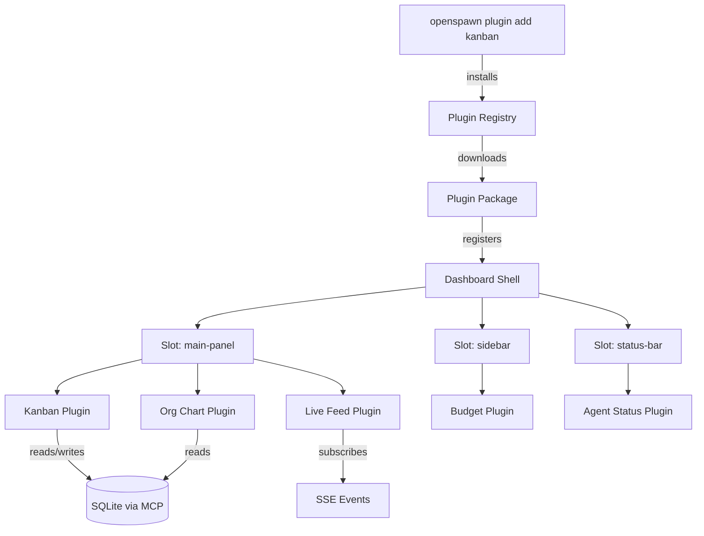
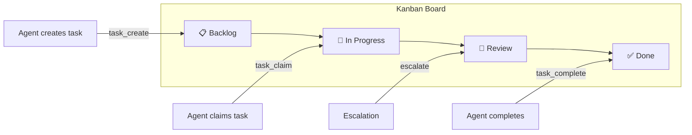
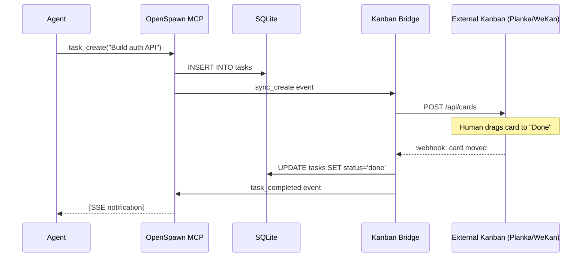
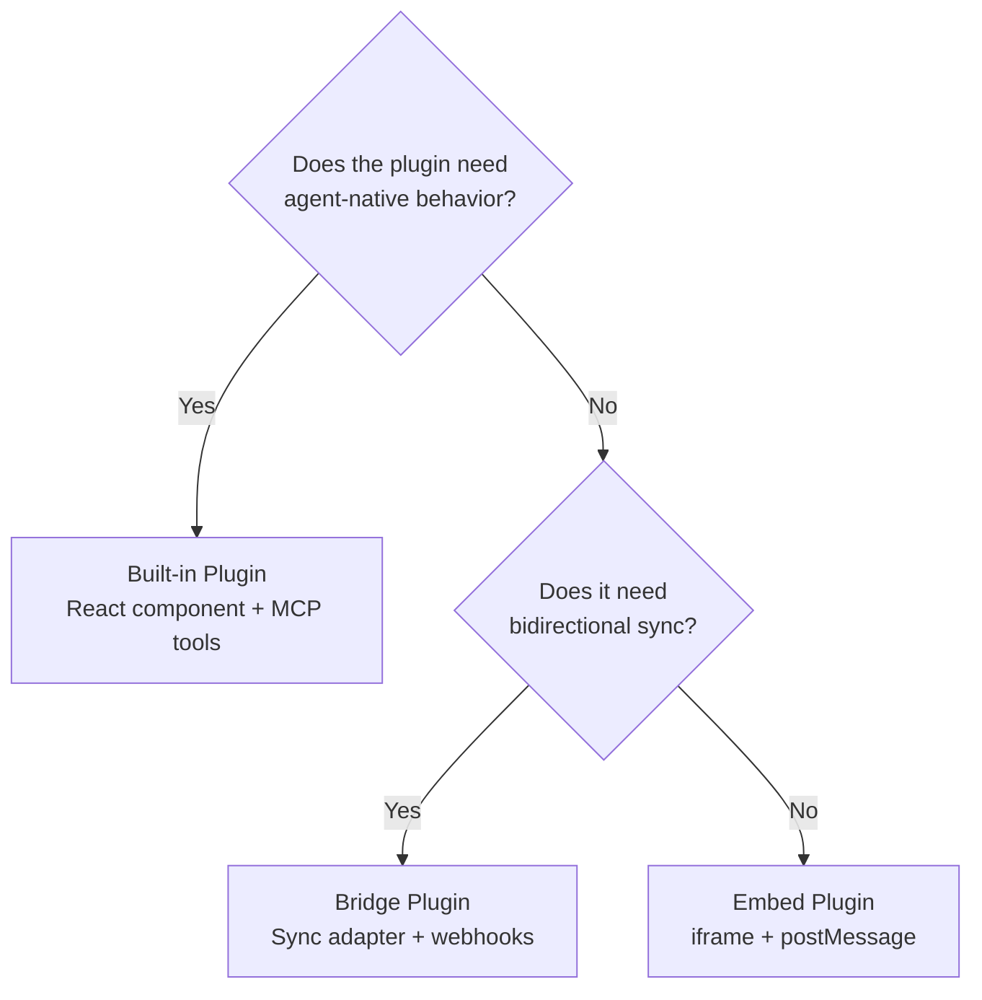
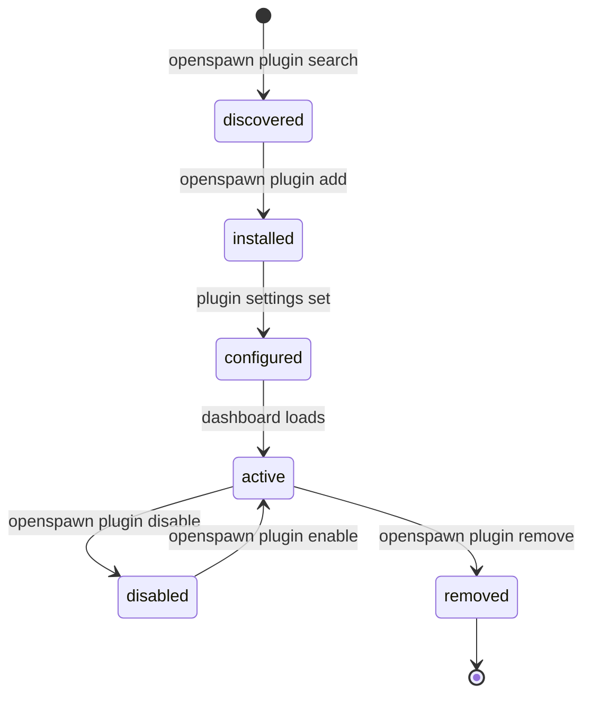

# Plugin Ecosystem

<span class="status status-active">Designing</span>

_Updated: Feb 26, 2026_

## The Idea

The OpenSpawn dashboard shouldn't be a monolith. Every major feature — kanban, org chart, budget meters, live feed — should be a **plugin** that can be swapped, extended, or replaced with existing tools.

## Why Plugins

1. **Don't rebuild what exists.** There are excellent self-hosted kanban tools. Let people use them.
2. **Agent-installable.** An agent should be able to `openspawn plugin add kanban` and get a task board.
3. **Composable dashboards.** Every org is different — let them pick their views.
4. **Community growth.** Third-party plugins = ecosystem = moat.

## Architecture



## Plugin Interface (Draft)

```typescript
interface OpenSpawnPlugin {
  id: string; // "kanban", "org-chart", "budget"
  name: string; // "Kanban Board"
  version: string;
  slot: "sidebar" | "main-panel" | "status-bar" | "overlay";

  // React component to render
  component: React.ComponentType<PluginProps>;

  // MCP tools this plugin needs access to
  requiredTools?: string[]; // ["task_create", "task_claim", "task_list"]

  // Plugin-specific settings
  settings?: PluginSetting[];

  // Optional: plugin provides its own MCP tools
  providedTools?: MCPToolDefinition[];
}

interface PluginProps {
  // SQLite access via MCP
  mcp: MCPClient;
  // SSE event stream
  events: EventSource;
  // Current org config
  org: OrgConfig;
  // Plugin settings
  settings: Record<string, unknown>;
}
```

## Kanban Plugin — The First Plugin

### What It Does



- Cards = tasks from SQLite `tasks` table
- Columns = task statuses (open → claimed → review → done)
- Cards show: assignee avatar, priority, created time, parent task
- Drag-and-drop reassignment (human override)
- Real-time updates via SSE

### Integration with Existing Tools

Rather than building everything from scratch, we should support **bridging** to popular self-hosted kanban tools:

| Tool                      | Stars | Status      | Integration Approach                                            |
| ------------------------- | ----- | ----------- | --------------------------------------------------------------- |
| **Claw-Kanban**           | New   | Active      | Native inspiration — agent-first routing, role-based assignment |
| **Focalboard/Mattermost** | 22k+  | Active      | REST API bridge — sync tasks bidirectionally                    |
| **WeKan**                 | 19k+  | Active      | REST API bridge                                                 |
| **Planka**                | 8k+   | Active      | Clean API, good UI — closest to what we'd want natively         |
| **Kanboard**              | 8k+   | Maintenance | JSON-RPC API — stable but aging                                 |
| **Leantime**              | 5k+   | Active      | REST API, includes project management beyond kanban             |
| **Vikunja**               | 4k+   | Active      | Modern API, task-focused, CalDAV support                        |

### Bridge Architecture



**Key principle:** SQLite is always the source of truth. External tools are views/mirrors.

## Built-in vs Bridge vs External



**Built-in:** Kanban, org chart, live feed, budget — things agents interact with directly
**Bridge:** Planka, WeKan, Jira — tools humans already use, synced to SQLite
**Embed:** Grafana, custom dashboards — read-only views in an iframe

## Plugin Lifecycle



## CLI Commands

```bash
openspawn plugin search kanban          # search registry
openspawn plugin add kanban             # install
openspawn plugin add planka-bridge      # install bridge
openspawn plugin list                   # show installed
openspawn plugin config kanban          # edit settings
openspawn plugin disable kanban         # disable without removing
openspawn plugin remove kanban          # uninstall
```

## Plugin Registry

Two options:

**Option A: npm-based** — plugins are npm packages with a naming convention (`openspawn-plugin-*`)

- Pro: existing infrastructure, versioning, publishing
- Con: requires npm account, not agent-discoverable

**Option B: Git-based** — plugins are GitHub repos with a `plugin.json` manifest

- Pro: agents can discover via GitHub search, fork and modify easily
- Con: no versioning/deduplication built in

**Option C: Custom registry (like ClawHub)** — JSON registry file listing available plugins

- Pro: curated, agent-discoverable via `llms.txt`
- Con: requires maintenance

**Recommendation: Start with npm, add to llms.txt for agent discovery.**

## First Plugins Roadmap

| Plugin          | Type     | Priority | Description                           |
| --------------- | -------- | -------- | ------------------------------------- |
| `kanban`        | Built-in | P0       | Task board from SQLite tasks table    |
| `org-chart`     | Built-in | P0       | Interactive org hierarchy from ORG.md |
| `live-feed`     | Built-in | P1       | Real-time agent message stream        |
| `budget`        | Built-in | P1       | Per-agent token/cost tracking         |
| `planka-bridge` | Bridge   | P2       | Bidirectional sync with Planka        |
| `github-bridge` | Bridge   | P2       | Sync tasks ↔ GitHub Issues            |
| `metrics`       | Built-in | P3       | Agent performance dashboard           |

## Inspiration from Claw-Kanban

What Claw-Kanban gets right:

- **Agent-first design** — tasks route to agents by role, not manually
- **Role-based auto-assignment** — matches our ORG.md level/role system
- **Real-time monitoring** — agents report status as they work
- **Multi-agent support** — Claude, Codex, Gemini all supported

What we'd add:

- **Hierarchy** — Claw-Kanban is flat. OpenSpawn has departments, reporting chains, escalation.
- **Persistence** — tasks survive agent crashes. SQLite, not in-memory.
- **Budget enforcement** — agents can't burn unlimited tokens.
- **Plugin architecture** — kanban is one view of the data, not the whole product.
